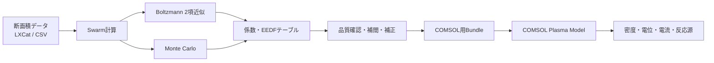
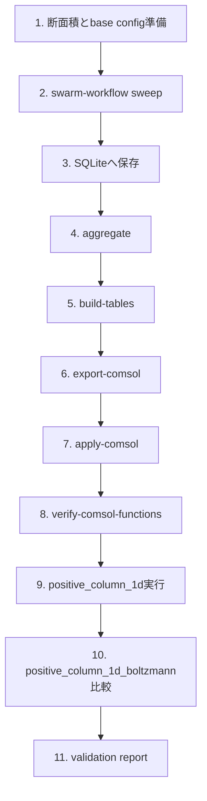
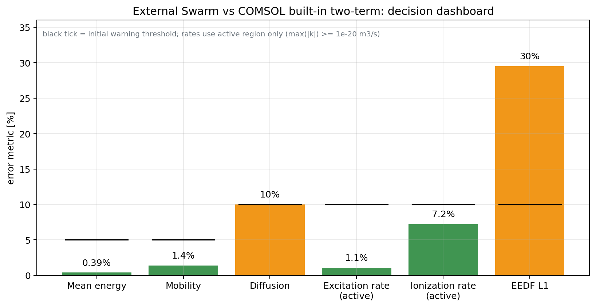
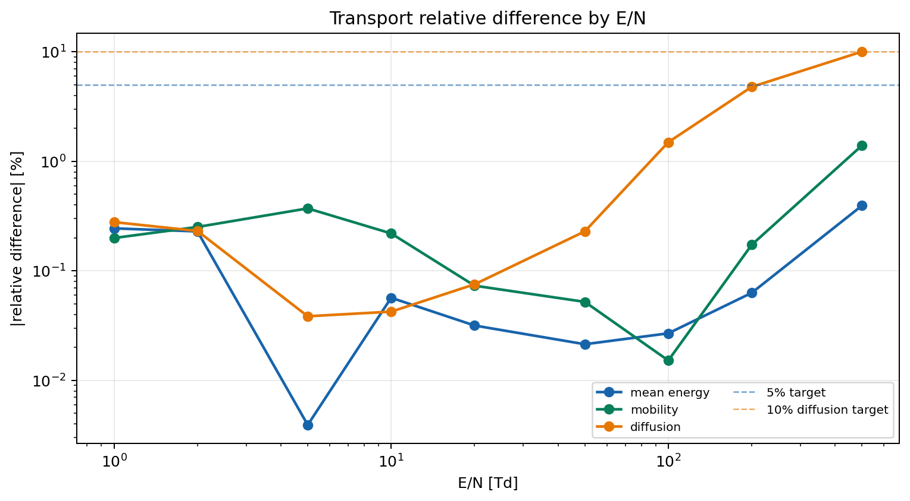
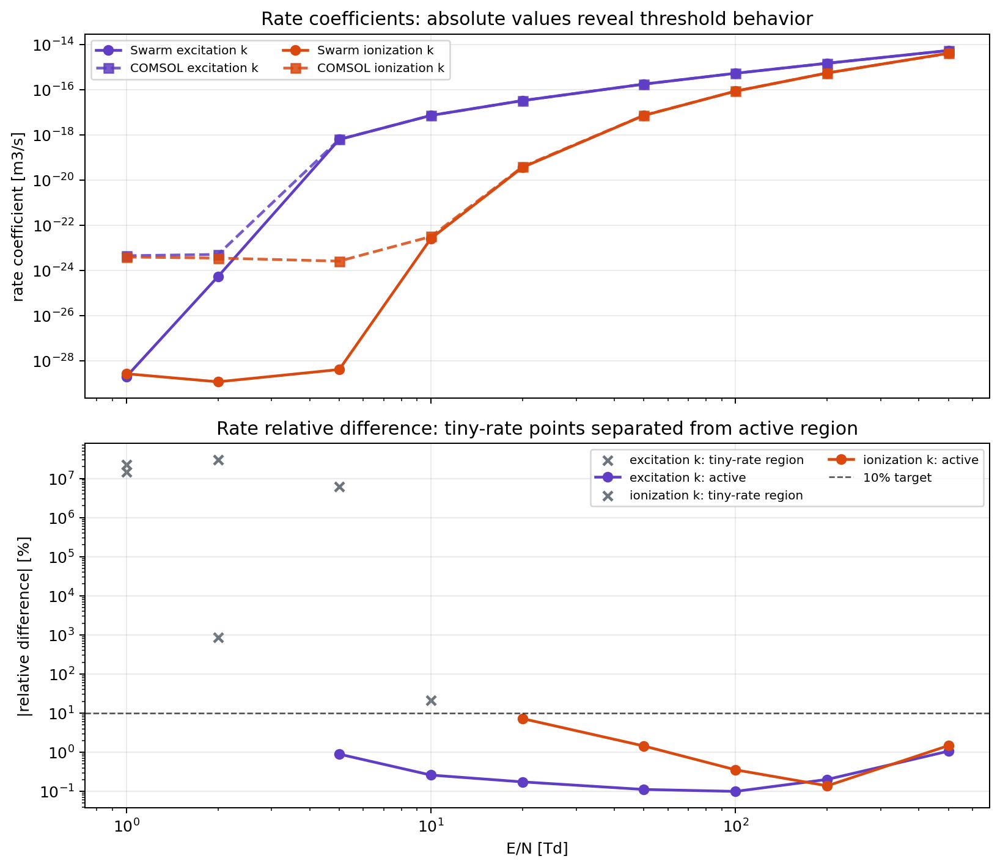
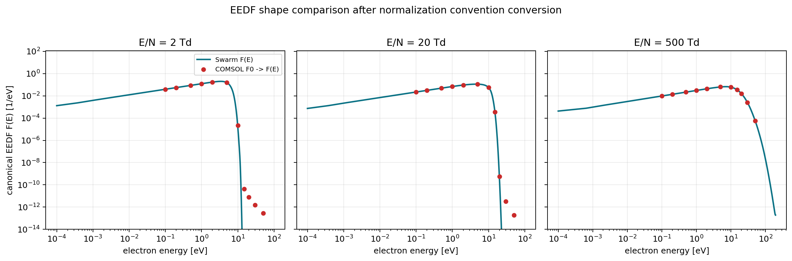
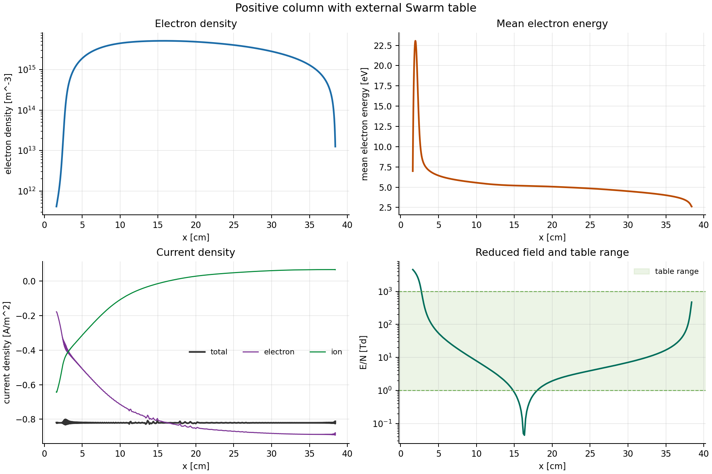
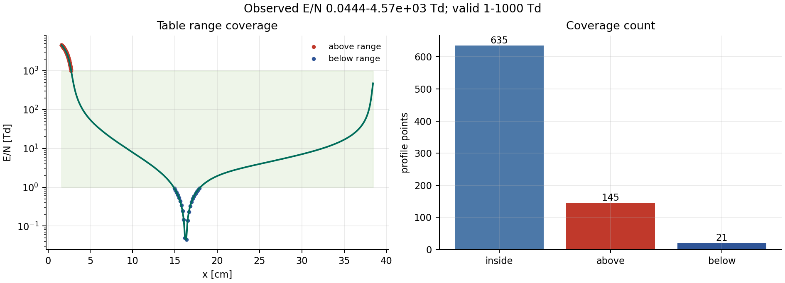

# 外部Swarm計算テーブルを用いたCOMSOLプラズマ計算拡張レポート

**対象読者**  
半導体プロセス・プラズマ装置エンジニア、COMSOLモデリング担当者、電子衝突データを扱う解析担当者

**対象範囲**  
電子Swarm計算（Boltzmann 2項近似・Monte Carlo）で事前計算した電子輸送係数、反応速度係数、EEDF関連データをCOMSOL Plasma Moduleへ入力し、空間依存プラズマ計算を効率化するためのワークフローと検証方法を整理する。

---

## 1. 背景

半導体プロセスで用いられる低温プラズマでは、電子が電界から得たエネルギーを背景ガスとの衝突で失いながら、励起、電離、解離、付着などの反応を駆動する。  
そのため、流体モデルであっても、以下の電子衝突データが計算結果を大きく左右する。

| 区分 | 代表的な量 | プラズマ計算への影響 |
|---|---|---|
| 電子輸送 | 移動度、拡散係数、電子エネルギー輸送係数 | 電子密度分布、電流、シース、エネルギー輸送 |
| 電子衝突反応 | 励起、電離、付着、解離などの速度係数 | プラズマ維持、ラジカル生成、イオン生成 |
| EEDF | 電子エネルギー分布関数 | 高しきい値反応、電離率、励起率 |
| Townsend係数 | 電界駆動反応係数 | DC放電、陰極降下、正柱領域の安定性 |

COMSOL Plasma Moduleでは、EEDFをMaxwellianやDruyvesteynなどの解析分布で近似する方法に加え、Boltzmann Equation, Two-Term Approximationを用いてEEDFを計算し、そのEEDFから輸送係数や反応速度係数を求める方法がある。COMSOLの`boltzmann_argon`例題でも、EEDFは放電挙動、電子衝突反応速度、流体モデルで用いる係数に重要な影響を与えると説明されている[^comsol-boltzmann-argon]。

一方で、空間依存プラズマモデルの各位置でBoltzmann方程式を連成して解くと、計算コストと非線形性が大きくなる。COMSOLの`positive_column_1d_boltzmann`例題では、空間依存の流体モデルとBoltzmann 2項近似を連成し、局所EEDFから反応速度係数と輸送係数を計算する構成が示されている[^comsol-positive-boltzmann]。この方法は物理的に強力だが、パラメータ掃引や装置条件最適化では計算時間が課題になりやすい。

---

## 2. 課題

今回のプロジェクトで解きたい課題は、次の4点である。

| 課題 | 内容 |
|---|---|
| 計算時間 | COMSOL内でBoltzmann 2項近似を空間連成すると、パラメータ掃引で計算負荷が大きくなる |
| 再現性 | 外部断面積、EEDF、反応速度係数の扱いがモデル内に散らばると、入力条件の管理が難しくなる |
| MC補正 | Monte Carlo計算で得られる非Maxwell的な尾部や統計的不確かさをCOMSOLへ直接活用しにくい |
| 混合比掃引 | 複数E/N、複数ガス比率の電子データをCOMSOLモデルへ一貫して入力する仕組みが必要 |

特に半導体プロセスでは、ガス比率、圧力、電力、電極電圧、周波数などの条件を多数掃引する。COMSOL内で毎回Boltzmann方程式を解くよりも、電子Swarm計算を外部で事前に行い、COMSOLにはテーブルとして入力する方が、実務上の探索効率を高めやすい。

---

## 3. 今回の拡張の目的

今回の拡張の目的は、電子Swarm計算とCOMSOLプラズマ計算を次のように分離することである。



目的は単にCSVを作ることではなく、以下を実現することである。

| 目的 | 期待効果 |
|---|---|
| Swarm計算の事前実行 | COMSOL内のBoltzmann連成を減らし、計算時間を短縮 |
| E/N・混合比の体系的掃引 | プロセス条件変更に対して再利用可能な電子データベースを作成 |
| MC結果の活用 | 高エネルギー尾部や反応速度の不確かさを評価可能にする |
| COMSOL入力の標準化 | 単位、引数、反応係数、EEDF規格化の混乱を防ぐ |
| 検証可能性 | COMSOL内蔵Boltzmann結果との差分を定量化し、物理的に説明する |

---

## 4. 今回整備した機能の全体像

今回のCOMSOL用拡張は、大きく5つの機能で構成される。

| 機能 | 内容 | 主な利用者 |
|---|---|---|
| Swarm計算本体 | Boltzmann 2項近似、MC、EEDF、輸送係数、反応速度係数を計算 | 電子衝突データ担当 |
| Sweep workflow | E/Nと混合比を変えて計算し、SQLiteへ保存 | 解析担当 |
| Table生成 | COMSOLで使いやすい1D/2Dテーブルへ整形 | 解析担当 |
| COMSOL adapter | テーブルをCOMSOLモデルのInterpolation functionとして登録 | COMSOLモデリング担当 |
| 検証・レポート | COMSOL内蔵Boltzmann、外部テーブル版、元モデルを比較 | 第三者レビュー担当 |

設計上の重要な考え方は、**Swarm計算本体とCOMSOL操作を分ける**ことである。  
Swarm計算本体はCOMSOLを知らず、COMSOL adapter側がSwarmの出力を読み取ってCOMSOLへ渡す。これにより、電子物理の計算とCOMSOLモデル操作を独立に検証できる。

---

## 5. 入力データと出力データ

### 5.1 Swarm計算の入力

| 入力 | 内容 |
|---|---|
| 電子衝突断面積 | 弾性、運動量移行、励起、電離、付着、超弾性など |
| ガス条件 | ガス温度、圧力または数密度 |
| 混合比 | Ar、O₂、N₂などのモル分率 |
| E/N | 換算電界。単位はTdまたはSIのV·m² |
| solver | Boltzmann 2項近似、Monte Carlo |
| MC条件 | 粒子数、collision数、replicate数、seed |

### 5.2 Swarm計算の主な出力

| 出力 | 単位 | COMSOLでの用途 |
|---|---:|---|
| 平均電子エネルギー | eV | Local Field / Local Energyの対応づけ |
| \(\mu_e N\) | \(1/(\mathrm{V\,m\,s})\) | 電子fluxの移動度 |
| \(D_e N\) | \(1/(\mathrm{m\,s})\) | 電子拡散 |
| \(\mu_\varepsilon N\) | eV/\((\mathrm{V\,m\,s})\) | 電子エネルギーflux |
| \(D_\varepsilon N\) | eV/\((\mathrm{m\,s})\) | 電子エネルギー拡散 |
| \(k_j\) | \(\mathrm{m^3/s}\) | 電子衝突反応速度 |
| \(\alpha_j/N\) | \(\mathrm{m^2}\) | Townsend形式の反応係数 |
| EEDF | \(1/\mathrm{eV}\) | EEDF確認・再積分・COMSOL F0変換 |
| F0 | \(\mathrm{eV^{-3/2}}\) | COMSOL EEDFテーブル入力 |
| 品質指標 | - | MC統計、不確かさ、テーブル採否 |

---

## 6. EEDFの扱い

EEDFは、今回の拡張で最も間違えやすい部分である。

### 6.1 本プロジェクト内のEEDF

本プロジェクトでは、EEDFを次の規格化で保存する。

\[
\int_0^\infty F(\varepsilon)\,d\varepsilon = 1
\]

ここで、

- \(\varepsilon\): 電子エネルギー [eV]
- \(F(\varepsilon)\): 本プロジェクト内のEEDF [1/eV]

である。

### 6.2 COMSOLで使われるF0

COMSOLのBoltzmann 2項近似では、EEDFをしばしば次の形で扱う。

\[
\int_0^\infty \sqrt{\varepsilon}\,F_0(\varepsilon)\,d\varepsilon = 1
\]

このとき、本プロジェクトのEEDFとの関係は、

\[
F_0(\varepsilon) =
\frac{F(\varepsilon)}{\sqrt{\varepsilon}}
\]

である。

| 表記 | 規格化 | 単位 | 主な用途 |
|---|---|---:|---|
| \(F(\varepsilon)\) | \(\int F d\varepsilon = 1\) | \(1/\mathrm{eV}\) | Swarm内部、保存、再積分 |
| \(F_0(\varepsilon)\) | \(\int \sqrt{\varepsilon}F_0 d\varepsilon = 1\) | \(\mathrm{eV^{-3/2}}\) | COMSOLのEEDFテーブル |
| EEPF | \(F/\sqrt{\varepsilon}\) | \(\mathrm{eV^{-3/2}}\) | COMSOL型F0と同等の表示 |

実装上は、\(\varepsilon=0\)で割り算を行わないようにする必要がある。COMSOLへ出力するEEDFテーブルでは、正のセル中心を使い、ゼロエネルギー点に人工的な巨大値を入れない。

---

## 7. 輸送係数の扱い

COMSOLの電子流体モデルでは、電子密度と電子エネルギーの輸送を解くために、電子移動度、電子拡散係数、電子エネルギー移動度、電子エネルギー拡散係数が必要になる。

今回の拡張では、ガス数密度で規格化されたreduced coefficientを主データとして保持する。

\[
\mu_e = \frac{\mu_e N}{N}
\]

\[
D_e = \frac{D_e N}{N}
\]

ここで、

- \(N\): ガス数密度 [1/m³]
- \(\mu_e N\): reduced mobility
- \(D_e N\): reduced diffusion

である。

| 係数 | 保存形式 | COMSOLでの意味 |
|---|---|---|
| \(\mu_e N\) | reduced | 電子移動度 |
| \(D_e N\) | reduced | 電子拡散 |
| \(\mu_\varepsilon N\) | reduced | 電子エネルギー移動度 |
| \(D_\varepsilon N\) | reduced | 電子エネルギー拡散 |

Boltzmann 2項近似では、EEDFと運動量移行断面積からこれらの係数を評価する。MCでは粒子追跡から一部のflux-like輸送係数を評価できるが、電子エネルギー輸送係数まで直接安定に求めるには追加検証が必要である。したがって初期の実用では、MCをすべての輸送係数に直接使うのではなく、Boltzmann 2項を基底として、MCは反応速度や尾部補正に使う方が安全である。

---

## 8. 反応速度係数とTownsend係数

電子衝突反応の基本形は、

\[
R_j = k_j n_e n_{\mathrm{target}}
\]

である。

ここで、

- \(R_j\): 反応速度 [1/(m³·s)]
- \(k_j\): 反応速度係数 [m³/s]
- \(n_e\): 電子密度 [1/m³]
- \(n_{\mathrm{target}}\): 対象ガス種または励起種の数密度 [1/m³]

である。

混合ガスで重要なのは、**COMSOL側で対象種濃度を掛ける場合、外部table側で混合比を二重に掛けない**ことである。

| 値 | 定義 | COMSOLでの使い方 |
|---|---|---|
| 非混合重み付き \(k_j\) | 対象種単独の反応速度係数 | 通常のElectron Impact Reactionに推奨 |
| 混合重み付き \(x_j k_j\) | モル分率込みの速度係数 | 背景ガスを明示種として解かない簡略モデル用 |
| Townsend \(\alpha_j/N\) | \(k_j/|w|\) | DC放電の電界駆動反応に有効 |
| 混合重み付きTownsend | \(x_j k_j/|w|\) | 簡略背景ガスモデル用 |

COMSOLの`positive_column_1d`では、電子衝突反応にTownsend coefficientのlookup tableを使う構成が示されている[^comsol-positive-column]。今回の外部Swarm table方式では、この考え方を拡張し、Boltzmann 2項・MCから得たTownsend係数をCOMSOLへ入力できるようにする。

---

## 9. COMSOLへ渡すテーブル

COMSOL用bundleは、固定混合比ごとに作るのが初期運用として最も安全である。

```text
outputs/comsol_bundle/mixture_0000/
  manifest.json
  mean_energy_vs_en.csv
  transport_vs_en.csv
  rates_vs_en.csv
  townsend_vs_en.csv
  energy_loss.csv
  quality.csv
  eedf_f0.csv          # 必要時のみ
```

### 9.1 `manifest.json`

`manifest.json`は、COMSOLへ渡すテーブル群の目録である。

| 項目 | 内容 |
|---|---|
| source | two_term、monte_carlo、hybrid |
| mixture | ガス種とモル分率 |
| E/N range | 有効なE/N範囲 |
| units | 各CSV列の単位 |
| quality | MC統計、不確かさ、採否 |
| files | transport、rates、Townsend、EEDFなどのCSV一覧 |

このファイルはCOMSOL計算そのものの物理式には使われないが、adapterが安全に入力を検査するために必須である。

### 9.2 `transport_vs_en.csv`

| 列 | 内容 |
|---|---|
| `E_over_N_Td` | E/N [Td] |
| `E_over_N_V_m2` | E/N [V·m²] |
| `mean_energy_eV` | 平均電子エネルギー |
| `reduced_mobility_m2_V_s_m3` | \(\mu_eN\) |
| `reduced_diffusion_L_m2_s_m3` | \(D_LN\) |
| `reduced_diffusion_T_m2_s_m3` | \(D_TN\) |
| `reduced_electron_energy_mobility...` | \(\mu_\varepsilon N\) |
| `reduced_electron_energy_diffusion...` | \(D_\varepsilon N\) |

### 9.3 `rates_vs_en.csv`

| 列 | 内容 |
|---|---|
| `reaction_id` | 反応ID |
| `species` | 対象種 |
| `process` | 反応名 |
| `process_type` | excitation、ionizationなど |
| `rate_coefficient_m3_s` | 非混合重み付き速度係数 |
| `target_species_fraction` | 対象種モル分率 |
| `mixture_weighted_rate_m3_s` | 混合重み付き速度係数 |
| `energy_loss_eV` | 反応エネルギー損失 |
| `energy_loss_rate_coefficient_eV_m3_s` | \(k_j \Delta\varepsilon_j\) |

### 9.4 `townsend_vs_en.csv`

| 列 | 内容 |
|---|---|
| `reduced_townsend_m2` | \(k_j/|w|\) |
| `mixture_weighted_reduced_townsend_m2` | \(x_jk_j/|w|\) |
| `valid_for_dc_field_driven` | DC電界駆動で使うか |
| `low_en_warning` | 低E/Nでの注意 |

低E/N領域ではdrift velocityが小さくなり、Townsend係数が数値的に不安定になりやすい。使用範囲をmanifestに明示し、COMSOLで範囲外評価が起きた場合は結果を採用しない。

---

## 10. COMSOLモデルと検証の役割

今回使うCOMSOL Application Libraryモデルは、目的ごとに役割が異なる。

| モデル | 用途 | 位置づけ |
|---|---|---|
| `boltzmann_argon.mph` | Swarm 2項とCOMSOL 2項の単体比較 | 係数・EEDF定義の検証 |
| `positive_column_1d.mph` | 外部Swarm table入力のテンプレート元 | 実プラズマ計算 |
| `positive_column_1d_boltzmann.mph` | COMSOL内蔵Boltzmann連成モデル | A/B比較参照 |

`positive_column_1d`は、reduced mobilityとTownsend lookup tableを使うDC glow dischargeモデルであり、外部Swarm table方式の検証に適している[^comsol-positive-column]。  
`positive_column_1d_boltzmann`は、COMSOL内でBoltzmann 2項方程式を空間依存流体モデルと連成する参照モデルである[^comsol-positive-boltzmann]。

---

## 11. 推奨ワークフロー



### 11.1 実行の考え方

| 段階 | 目的 | 失敗時に疑う箇所 |
|---|---|---|
| Swarm計算 | 係数とEEDFを生成 | 断面積、E/N範囲、solver設定 |
| Table生成 | COMSOL入力形式へ変換 | 単位、補間、混合比、品質判定 |
| COMSOL import | functionが正しく読めるか | tag、CSV列、単位、path |
| Boltzmann単体比較 | SwarmとCOMSOLの2項差分確認 | EEDF規格化、離散化、反応定義 |
| positive column実行 | 外部tableでプラズマ計算 | COMSOL式、範囲外、収束性 |
| A/B比較 | 内蔵Boltzmannとの差分評価 | 物理モデル差、非線形増幅 |

---

## 12. 実COMSOL評価で確認すべき項目

COMSOL計算が「実行できた」だけでは不十分である。今回の目的では、精度、収束性、計算速度をまとめて評価する必要がある。

### 12.1 Function import確認

| 項目 | 合格目安 |
|---|---:|
| COMSOL function評価値とCSV値の相対誤差 | \(10^{-6}\)以下 |
| E/N単位変換 | 誤差なし |
| 負のrate、負のtransport | 0 |
| NaN | 0 |
| F0規格化誤差 | \(10^{-6}\)以下 |
| table範囲外評価 | 原則0 |

### 12.2 Boltzmann単体比較

| 指標 | 初期目安 |
|---|---:|
| 平均電子エネルギー差 | 5%以内 |
| 移動度差 | 5%以内 |
| 拡散係数差 | 10%以内 |
| 主要反応速度差 | 10%以内 |
| EEDF L1誤差 | 0.1以下 |

完全一致を期待する必要はない。エネルギー格子、補間、境界条件、電離源モデル、EEDF規格化の差により、数%から十数%の差が出る場合がある。

### 12.3 Plasma model比較

| 指標 | 見る理由 |
|---|---|
| 電子密度分布 | 電離源・輸送係数の総合影響 |
| 平均電子エネルギー | EEDF閉じ方の違い |
| 電位分布 | 電荷分離と電流整合 |
| E/N分布 | table範囲外確認 |
| 電離・励起source | 高エネルギー尾部の影響 |
| 電子・イオン電流 | DC放電の整合性 |
| 壁flux | 表面反応・電流閉じの確認 |
| runtime | 外部table方式の効率評価 |
| solver warning | 収束性・外挿・負値の確認 |

---

## 13. COMSOL計算の収束性を良くする入力方法

外部table方式では、COMSOLの非線形solverが参照する係数がテーブル補間値になる。したがって、テーブルの滑らかさと有効範囲が重要になる。

| 対策 | 目的 |
|---|---|
| E/N範囲を広めに取る | シースや陰極降下での範囲外評価を防ぐ |
| 反応立ち上がり近傍を細かく刻む | 電離・付着sourceの急変を滑らかにする |
| 正の量はlog補間 | 負値やovershootを防ぐ |
| MC値は平滑化・品質判定後に使用 | 統計ノイズをCOMSOLへ入れない |
| table範囲外をwarning/failにする | 信頼できない外挿を避ける |
| 初期解から段階的に電圧を上げる | Newton法の初期不安定を避ける |
| Townsend形式とrate形式を使い分ける | DC放電の安定性と低E/Nの安定性を両立 |

---

## 14. 外部Swarm table方式のメリット

| 観点 | 外部Swarm table方式 | COMSOL内蔵Boltzmann連成 |
|---|---|---|
| 計算速度 | 速い。COMSOL内でEEDFを毎回解かない | 遅くなりやすい |
| パラメータ掃引 | 同じtableを再利用可能 | 各条件で連成計算が重い |
| MC活用 | MC補正・不確かさを反映可能 | 標準では2項近似 |
| 入力管理 | SQLite、manifest、CSVで追跡可能 | COMSOLモデル内に閉じやすい |
| 自己無撞着性 | table軸の範囲内 | 局所状態に応じてEEDF更新 |
| 混合比変化 | 事前に軸として計算可能 | COMSOL内の種組成と連成可能 |
| 検証性 | CSV単位で比較しやすい | モデル内部依存が強い |

外部table方式は、量産条件スクリーニング、ガス比率・電圧・圧力掃引、装置設計の初期探索に適している。一方、局所組成や励起種密度がEEDFへ強く影響する場合は、COMSOL内蔵Boltzmann連成や追加table軸が必要になる。

---

## 15. 注意すべき制約

### 15.1 ArモデルでAr/O₂混合比を評価する場合

`positive_column_1d`は基本的にAr放電モデルである。  
Swarm側でAr/O₂混合比の電子輸送係数を作っても、COMSOL側にO₂、O₂⁺、O⁻、O、O₂(a)、解離反応、付着反応、表面反応が入っていなければ、混合ガスプラズマモデルとしては不完全である。

したがって初期検証は、

```text
Ar単一ガス
Boltzmann 2項
positive_column_1d
```

で行う。  
Ar/O₂やAr/N₂の物理評価へ進む場合は、COMSOL側にも対応するheavy species、反応式、壁反応を追加した別テンプレートが必要である。

### 15.2 MCの使い方

MCは高エネルギー尾部や2項近似の補正に有用だが、統計ノイズを持つ。

| MCデータ | 推奨用途 |
|---|---|
| EEDF | tail確認、rate再積分、Boltzmannとの差分 |
| rate coefficient | replicate集約後の補正 |
| mobility/diffusion | 品質確認後に補正 |
| energy transport | 初期実装ではBoltzmann 2項を基底にする |

MC結果をそのままCOMSOLへ入れるのではなく、replicate、RSE、品質判定、平滑化を経由して使う。

---

## 16. 第三者レビュー用チェックリスト

| 確認項目 | OK条件 |
|---|---|
| 断面積 | SwarmとCOMSOL比較で同じファイルを使っている |
| E/N単位 | TdとV·m²の変換が明記されている |
| EEDF規格化 | \(F\)と\(F_0\)の変換が確認されている |
| 反応速度 | 混合比を二重に掛けていない |
| 輸送係数 | reducedとactualの違いが管理されている |
| COMSOL function | CSV値とCOMSOL評価値が一致している |
| table範囲 | COMSOL解のE/Nが有効範囲内 |
| positive column | 外部table関数を実際に参照している |
| A/B比較 | 内蔵Boltzmannとの差分が定量化されている |
| 速度 | 外部table方式のruntime短縮が測定されている |

---

## 17. 実COMSOLベンチマーク結果

この節では、ローカルCOMSOLで実行した検証結果を、外部Swarm table方式の採否判断に使える形で整理する。結果ファイルは主に以下を参照した。

| 検証 | 出力 |
|---|---|
| COMSOL interpolation function確認 | `outputs/validation/010_function_verify/` |
| Swarm two-term vs COMSOL内蔵two-term | `outputs/validation/020_boltzmann_argon/` |
| 外部Swarm table版positive column実行 | `outputs/validation/030_positive_column_external/` |

### 17.1 COMSOL function import確認

外部Swarm tableをCOMSOLのInterpolation functionとして読み込ませ、COMSOL側で評価した値と元CSV値を比較した。

| 項目 | 結果 |
|---|---:|
| 対象function数 | 9 |
| 評価点数 | 30 |
| pass / fail | 30 / 0 |
| 最大相対誤差 | \(7.20\times10^{-16}\) |
| 最大絶対誤差 | \(3.76\times10^{-37}\) |
| 負値またはNaN | 0 |

この確認では、`sw_meanE`、`sw_muN`、`sw_DLN`、`sw_DTN`、`sw_muEnergyN`、`sw_DEnergyN`、`sw_alpha_eff`、`sw_alpha_exc`、`sw_alpha_ion` がCOMSOL内で元CSVと一致して評価された。したがって、少なくとも今回のAr単一ガスbundleでは、CSV列、単位、function tag、COMSOL importの対応は正しく通っている。

### 17.2 Swarm two-term vs COMSOL内蔵two-term

`boltzmann_argon.mph`を参照し、外部Swarm `two_term` とCOMSOL内蔵two-term Boltzmannを単体比較した。比較対象はAr、断面積は `Model/Ar_xsecs.txt`、e-e衝突と磁場はoffである。COMSOL側は1, 2, 5, 10, 20, 50, 100, 200, 500 Tdで比較でき、1000 Tdでは内蔵Boltzmannが収束失敗した。

| 指標 | 実測値 | 初期目安 | 判断 |
|---|---:|---:|---|
| 平均電子エネルギー最大相対差 | 0.394% | 5% | 良好 |
| reduced mobility最大相対差 | 1.39% | 5% | 良好 |
| reduced diffusion最大相対差 | 10.014% | 10% | 境界上のwarning |
| active領域の励起rate差 | 約1.1% | 10% | 良好 |
| active領域の電離rate差 | 約7.2% | 10% | 良好 |
| EEDF L1誤差 | 0.295 | 0.1 | warning |
| COMSOL収束 | 1000 Tdで失敗 | - | 高E/N側は要注意 |

低E/Nでは励起・電離rateの絶対値がほぼゼロに近く、相対差だけを見ると非常に大きくなる。採否判断では、rateが実際に立ち上がるactive領域と、positive column側のsource寄与を合わせて見る必要がある。









### 17.3 外部Swarm table版positive column実行

外部Swarm tableを読み込んだ `positive_column_1d` 相当モデルは、COMSOL return code 0で実行完了した。実行ログ上のsolver statusは `ok` であり、電子密度、平均電子エネルギー、source、E/Nなどの主要な正値量に負値またはNaNは出ていない。

| 項目 | 結果 |
|---|---:|
| COMSOL return code | 0 |
| solver status | ok |
| plasma total time | 143 s |
| solution time | 136 s |
| function verify最大相対誤差 | \(7.20\times10^{-16}\) |
| 電流密度のspan / 平均絶対値 | 3.66% |
| 正値量の負値またはNaN | 0 |
| 観測E/N範囲 | 0.0444-4572.5 Td |
| table有効範囲 | 1-1000 Td |
| table範囲外点 | 166 / 801 |

この結果から、外部table方式はCOMSOLモデルへ実際に接続でき、positive column計算も最後まで走ることが確認できた。一方で、解のE/Nがtable有効範囲の上下に外れている点がある。特に陰極側では1000 Tdを超えて最大4572.5 Tdに達しており、中心付近では1 Tdを下回る点がある。したがって、このpositive column結果は「接続・収束の確認」としては有効だが、最終的な物理ベンチマークとして採用する前に、Swarm tableのE/N範囲拡張またはCOMSOL側条件の見直しが必要である。





### 17.4 現時点の採否判断

| 項目 | 判断 |
|---|---|
| COMSOL function import | 採用可。CSVとCOMSOL評価値は実質一致 |
| two-term単体比較 | 条件付き採用可。平均エネルギーとmobilityは良好、diffusionとEEDFは追加確認 |
| 外部table positive column接続 | 実行可能。収束と正値性は確認済み |
| positive column物理結果 | 保留。E/N table範囲外が166点あるため、範囲拡張後に再評価 |
| 実務上の次手 | 0.03-5000 Td程度までAr tableを拡張し、陰極側高E/Nと中心低E/Nを再検証 |

結論として、外部Swarm table方式はCOMSOLへ接続でき、two-term単体比較でも主要輸送係数は良好に一致した。ただし、positive columnの最終採否は、table範囲外評価をなくした再ベンチマーク後に行うべきである。

---

## 18. まとめ

今回のCOMSOL用拡張により、電子Swarm計算で得たBoltzmann 2項近似・Monte Carlo結果を、COMSOL Plasma Moduleの空間依存プラズマ計算へ入力する流れが整理された。

主な成果は次の通りである。

| 項目 | 内容 |
|---|---|
| 事前計算 | 複数E/N・複数混合比のSwarm計算を外部で実行 |
| データ管理 | SQLite、manifest、CSV bundleで条件と結果を管理 |
| COMSOL入力 | transport、rate、Townsend、EEDF/F0を標準テーブル化 |
| 検証 | COMSOL function確認、Boltzmann単体比較、positive column A/B比較 |
| 実務効果 | COMSOL内蔵Boltzmann連成を減らし、掃引計算を効率化 |

最終的な採否は、以下で判断する。

```text
外部Swarm tableでCOMSOL計算が収束する
COMSOL function評価値が元CSVと一致する
Swarm 2項とCOMSOL 2項の差が許容範囲内
positive column結果の差分が物理的に説明できる
外部table方式で計算速度メリットがある
table範囲外評価や負値が発生しない
```

これらを満たす場合、外部Swarm table方式は、半導体プラズマプロセスの条件探索、ガス比率掃引、COMSOLモデル高速化に有用な手法として利用できる。

---

## 参考資料

[^comsol-boltzmann-argon]: COMSOL, *Argon Boltzmann Analysis*, Application Library path: `Plasma_Module/Two-Term_Boltzmann_Equation/boltzmann_argon`, COMSOL 6.4 documentation.  
https://doc.comsol.com/6.4/doc/com.comsol.help.models.plasma.boltzmann_argon/boltzmann_argon.html

[^comsol-positive-column]: COMSOL, *DC Glow Discharge, 1D*, Application Library path: `Plasma_Module/Direct_Current_Discharges/positive_column_1d`, COMSOL 6.4 documentation.  
https://doc.comsol.com/6.4/doc/com.comsol.help.models.plasma.positive_column_1d/positive_column_1d.html

[^comsol-positive-boltzmann]: COMSOL, *DC Glow Discharge Coupled with the Two-Term Boltzmann Equation*, Application Library path: `Plasma_Module/Space-Dependent_EEDF_Modeling/positive_column_1d_boltzmann`, COMSOL 6.4 documentation.  
https://doc.comsol.com/6.4/doc/com.comsol.help.models.plasma.positive_column_1d_boltzmann/positive_column_1d_boltzmann.html

[^comsol-programming]: COMSOL, *COMSOL Multiphysics Programming Reference Manual*, Interpolation function and model API reference, COMSOL 6.4 documentation.  
https://doc.comsol.com/6.4/doc/com.comsol.help.comsol/COMSOL_ProgrammingReferenceManual.pdf
