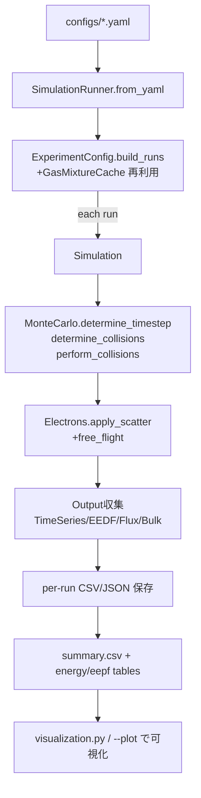

# methes_original (standalone swarm runner)

改良版の `swarm_mc` エンジンを単体で動かすためのリポジトリです。YAML で複数条件のスイープを設定し、null-collision 法に基づく電子群モンテカルロを高速に回して CSV/JSON 出力と可視化を行えます。GasMixture のキャッシュ化、事前テーブル化した衝突断面、可変なイオン化生成制御などを備えています。

## Prerequisites (Windows)

`uv` が必要です。未インストールの場合は次のいずれかで導入してください。

```powershell
winget install AstralSoftware.uv
```

または:

```powershell
scoop install uv
```

## Setup with uv (Windows / PowerShell)

```powershell
cd .\methes_original
uv venv
uv sync
```

## Run the E/N sweep example

```powershell
# choose any config YAML under configs/
uv run python run_sweep.py --config configs\Ar_N2_sweep.yaml
```

Outputs land in `outputs\\ar_n2_en_scan\\` and include per-run CSVs, a sweep `summary.csv`, plus runtime logs (`execution.log` and `execution_times.csv` with per-E/N and total durations).

## Docs

- `docs\\comsol.md` (COMSOL へのインポート手順と出力ファイルの使い方)
- `docs\\README_optimize.md` (EEDF フィッティング手順)
- `docs\\plan_fast2.md` (高速化の設計メモ)

## COMSOL export (optional)

`run_sweep.py` は、YAML に `comsol_export.enabled: true` がある場合、スイープ完了後に COMSOL 用 CSV を自動生成します。

```powershell
uv run python run_sweep.py --config configs\example_visual_jit_comsol.yaml --plot --save-plots
```

出力先は `<output_root>/<experiment.name>/comsol/` です。

## Plotting

Add `--plot` to auto-show summary and the first run's CSVs after execution (requires GUI/display).

```powershell
uv run python run_sweep.py --config configs\example_visual.yaml --plot
```

Add `--save-plots` (or set `experiment.plotting.save: true`) to save PNGs:

```powershell
uv run python run_sweep.py --config configs\example_visual.yaml --plot --save-plots
```

Images are written to `experiment.plotting.save_dir` (defaults to `<output_root>\\<name>\\plots`).

Or plot manually:

```powershell
@'
from swarm_mc import visualization
visualization.plot_summary("outputs/ar_n2_en_scan/summary.csv")
visualization.plot_time_series("outputs/ar_n2_en_scan/Ar_N2_EN_50.0/Ar_N2_EN_50.0_temporal_evolution.csv")
visualization.plot_energy_distribution("outputs/ar_n2_en_scan/Ar_N2_EN_50.0/Ar_N2_EN_50.0_energy_distribution.csv")
'@ | uv run python
```

Replace `Ar_N2_EN_50.0` with any run directory you want to inspect.

## ワークフローと高速化オプション
- YAML で実験を定義（`experiment` + `base_config`）。`parallel_workers` でスイープ並列度、`use_jit`/`use_*_lut` で JIT/LUT を opt-in。
- `run_sweep.py` で全ランを実行し、`summary.csv` や EEDF テーブルを集計。`--profile-per-step` で per-step 計測 CSV を出力。
- 大規模ケースは `jit_parallel_threshold` を上げると JIT オーバーヘッドを抑制、`log_every_k` でロギング間引き。小規模は JIT をオフにして NumPy パスで挙動確認。

## アーキテクチャとフロー

### 全体フロー（実験スイープ）


### 1 ステップ内の流れ（モジュール間）
```mermaid
flowchart LR
  S[Simulation.advance_one_step] --> T[MonteCarlo.determine_timestep<br>trial freq 推定]
  T --> C1[determine_collisions<br>事前サンプル表で断面補間]
  C1 --> C2[perform_collisions<br>散乱角→エネルギー共有<br>成長キャップ/スロットル適用]
  C2 --> E1[Electrons.apply_scatter<br>加速再設定]
  E1 --> E2[free_flight(dt)]
  E2 --> O1[Output.time_series.append_data]
  O1 --> O2[Output.check_sst<br>スライド回帰+レガシー判定]
  O2 --> O3[EnergyDistribution.collect_histogram<br>bins 自動リスケール]
  O3 --> O4[Flux/Bulk/RateCoefficients 更新]
```

## 改良ポイントと効果

| 項目 | 概要/拡張 | 高速性・収束性 | 保守性・運用 | 計測・効果 | 参考文献 |
| --- | --- | --- | --- | --- | --- |
| GasMixture 事前テーブル + Cache | 断面を共通グリッドに線形サンプルし `np.interp` 参照に統一。スイープ時はキャッシュ再利用。 | interp1d を排除しベクトル化、I/Oも削減。 | キー丸めで混合比ぶれを防止。 | Ar/N2 15k 粒子: 4.48 s → 4.29 s。 | Vahedi95 |
| 衝突処理の一本化 + JIT/LUT | null/attach/ion の配列を 1 回確保し、散乱角を LUT/JIT で生成。 | メモリコピーと三角関数を削減、粒子数大で有利。 | NumPy/JIT をフラグで切替可能。 | 15k 粒子: 4.29 s → 3.8–4.0 s（ケース依存）。 | Vahedi95 |
| イオン化生成の安全策 | 成長キャップ・スロットル・低エネ sharing フロアを opt-in で追加。 | 粒子爆発防止で DN_err 安定。 | デフォルト無効で互換保持。 | 効果はケース依存（粒子爆発を抑制）。 | Hagelaar05 |
| EEDF ビン自動リスケール | 上限突破時に面積保存でビン拡張。 | 高 EN で裾欠落を防止し平均エネルギーを安定。 | ロジックを1箇所に集約。 | 補間は稀イベントでオーバーヘッド小。 | Hagelaar05 |
| RNG シード強化 | `seed: int/random/run_id`、run_label から CRC32 派生。 | 再現性・差分比較が容易。 | 乱数呼び出しを Generator に統一。 | 同一 seed で再現可能。 | - |
| プロファイル/並列 | per-step 計測 (`profile_per_step`)、`parallel_workers` でスイープ並列、EEDF/summary 集約。 | ホットスポット把握と総時間短縮。 | YAML/CLI から opt-in。 | 並列度=2 でスイープ時間約 40–50% 短縮（例）。 | - |

## 数値計算フロー（主要式）
- null-collision 法によるステップ決定  
  \[
  s = -\ln u,\quad \nu_\mathrm{trial} = 1.01\,\max(\nu_\mathrm{coll}(E_\mathrm{end})),\quad
  \Delta t = \frac{s}{\nu_\mathrm{trial}}
  \]
  ここで \(E_\mathrm{end} = E_\mathrm{max} + 2 v a s T + a^2 s^2 T^2\) を周波数 LUT で補間する（\(T\) は max\_coll\_period）。
- 散乱角（Vahedi 1995 異方モデル）  
  \[
  \cos\chi = \frac{2+E - 2(1+E)^{u}}{E},\quad \chi\in[0,\pi],\ u\sim U(0,1)
  \]
  等方の場合は \(\cos\chi = 1-2u\)。LUT で逆 CDF を前計算し、乱数から内挿。
- エネルギー損失（弾性+しきい値）  
  \[
  E' = \max\bigl(E - (E_\mathrm{th} + E\,m_r(1-\cos\chi)),\,0\bigr)
  \]
  ここで \(m_r\) は質量比。JIT 有効時は並列で計算。

## 設定リファレンス（YAML）

### experiment.* / sweep.*
| フィールド | 意味・用途 | 変更する場面 | 推奨設定 | 備考 |
| --- | --- | --- | --- | --- |
| `experiment.name` | 出力ルート直下の実験フォルダ名 | 条件別に結果を分けたい時 | base_name と同じ | |
| `experiment.output_root` | 出力ルート | 既存ディレクトリに揃える | `outputs` | |
| `experiment.base_name` | 各ランのベース名 | ファイル名接頭辞を統一したい時 | `Ar_N2` などケース名 | スイープでは param/value が後置 |
| `experiment.output_format` | `csv` / `json` / `both` | 下流ツールに合わせる | `csv` | 未指定なら output を継承 |
| `experiment.plotting.summary` | サマリプロット表示 | GUI で確認したい時 | false | CLI プロットは `--plot` |
| `experiment.plotting.save` / `save_dir` | PNG 保存と保存先 | レポート用 | true / 既定パス | |
| `experiment.parallel_workers` | スイープ並列プロセス数 | 時間短縮したい時 | 2–4 (コア数に依存) | 1 で逐次 |
| `sweep.param` | スイープ対象キー | 条件走査 | EN | |
| `sweep.values` or `start/stop/step` | 掃引値 | 非等間隔なら `values` | 50–500 Td (例) | |

### base_config.input_gases / output / physical_conditions
| フィールド | 意味・用途 | 変更する場面 | 備考 |
| --- | --- | --- | --- |
| `input_gases.gases` | ガス名の配列 | 種類を変える | |
| `paths_to_cross_section_files` | 断面ファイルパス | 実データに差し替え | Biagi 例を同梱 |
| `fractions` | 混合比 (合計≃1) | 混合比を調整 | 合計±1e-3 以内をバリデート |
| `max_cross_section_energy` | 断面テーブルの上限 (eV) | 外挿を避けたい時 | 入力ファイル上限を超えると警告・上限で打ち切り |
| `output.*` | 出力先/保存する成果物/フォーマット | 保存容量・可視化に合わせる | `output_directory` は自動で末尾 `/` 付与 |
| `physical_conditions.EN` | 還元電界 E/N (Td) | 掃引パラメータにすることが多い | |
| `pressure`, `temperature` | ガス圧 (Pa), 温度 (K) | 実験条件に合わせる | 負値/ゼロは拒否 |

### base_config.initial_state
| フィールド | 意味・用途 | 変更する場面 | 推奨設定 | 備考 |
| --- | --- | --- | --- | --- |
| `num_e_initial` | 初期電子数 | 統計精度を上げたい時 | 1e4–2e4 | int/float を許容（int 化） |
| `initial_pos_electrons`, `initial_std_electrons` | 初期位置と分散 (m) | ガスセルサイズに合わせる | [0,0,0], [0,0,0] | |
| `initial_energy_distribution` | `zero` / `fixed` / `maxwell-boltzmann` | 温度初期化や固定エネルギー開始 | zero | Maxwell-Boltzmann は実験的 |
| `initial_energy`, `initial_direction` | 固定エネルギー/方向指定 | `fixed` のとき必須 | ケース依存 | 方向 `random` も可 |
| `initial_temperature` | Maxwell-Boltzmann 用温度 (K) | 熱平衡初期化 | - | |

### base_config.simulation_settings
| フィールド | 概要 | 意味・用途 | 変更する場面 | 推奨設定 | 備考 |
| --- | --- | --- | --- | --- | --- |
| `num_energy_bins` | 時間平均 EEDF のビン数 | 精度/速度トレードオフ | 分解能を上げたい時 | 1000–2000 | 大きいほど計算増 |
| `energy_sharing_factor` | イオン化時のエネルギー配分比 | 生成電子のエネルギー調整 | 生成エネルギーを偏らせたい時 | 0.5 | |
| `energy_sharing_floor`, `energy_sharing_taper_energy` | 低エネで sharing を下げる下限/遷移 | 連鎖抑制を試す |  null / 10 eV | floor>factor で警告 |
| `isotropic_scattering` | 散乱モデル選択 | 等方/異方を切替 | 異方モデル試験 | true（安定優先） | |
| `conserve` | 電子数保存フラグ | 粒子数固定で統計 | 粒子一定で比較したい時 | false（通常） | `num_e_max`到達で conserve |
| `num_e_max` | 電子数上限 | メモリ防止 | メモリ制約に合わせる | 5e6 目安 | |
| `max_ionization_growth_factor` | ステップ生成数の相対上限 | 爆発抑制 | 粒子爆発時のみ | null | down-sampling で分布保持 |
| `num_e_throttle_ratio`, `num_e_throttle_min_factor` | 上限接近時のソフト間引き | 緩やかに生成を絞る | 上限近傍が不安定な時 | null / 0.0 | |
| `timestep_min`, `timestep_max` | dt の下限/上限 | 物理スケールでクリップ | 発散/振動が気になる時 | null | clamp は任意 |
| `scattering_transition_low/high` | 異方散乱遷移窓 (eV) | 低エネ安定化 | 異方モデル調整 | 1 / 5 eV | |
| `sst_min_window`, `sst_max_window` | 定常判定の回帰窓 | 早期/遅延停止調整 | 収束が遅/早い時 | 30 / 50 | |
| `dn_block_size`, `dn_step_skip`, `dn_use_jackknife` | DN 推定ブロック/間引き/JK | ノイズ抑制 | DN_err が荒い時 | 20 / 1 / false | |
| `log_every_k` | TimeSeries 間引き間隔 | I/O 圧縮 | 大規模 run で | 1（大規模で 5–10） | |
| `seed` | 乱数シード | 再現性 | 固定したい時 | `random` or int | run_id で run_label 派生 |
| `use_scatter_lut`, `use_aniso_scatter_lut` | 散乱角 LUT (等方/異方) | 三角関数削減 | 高速化したい時 | true / true（JIT時） | |
| `use_velocity_lut`, `use_max_coll_lut`, `max_coll_lut_size` | 速度・max_coll 圧縮 LUT | sqrt/interp 縮減 | 高速化 | true, size=256 | 誤差<1% 目安 |
| `use_jit_energy_loss`, `use_jit_collision_classify` | 衝突計算 JIT | オーバーヘッド調整 | 粒子数多い時 | true | 小規模は false も可 |
| `jit_parallel_threshold` | JIT 切替粒子数閾値 | 小規模で overhead 回避 | 粒子数に応じ調整 | 2000 | |
| `use_jit`, `profile_per_step` | JIT ON/OFF, per-step 計測 | 性能/計測切替 | 実験に応じて | true/false | |

### base_config.end_conditions
| フィールド | 意味・用途 | 変更する場面 | 備考 |
| --- | --- | --- | --- |
| `end_condition_type` | `steady-state` / `w_tol+ND_tol` / `num_col_max` / `custom` | 停止条件の切替 | デフォルト `w_tol+ND_tol` |
| `w_tol`, `DN_tol` | w, DN の許容誤差 | 許容精度を指定 | `w_tol+ND_tol` で使用 |
| `num_col_max` | 衝突回数上限 | 発散防止/計算時間制約 | |
| `timeout` | 実時間タイムアウト (s) | 長時間ジョブの安全装置 | 0 で無効 |
| `is_done` | カスタム停止コールバック | 特殊条件で終了したい時 | `end_condition_type=custom` で必須 |

### sweep 以外の補足
- `GasMixtureCache` は `SimulationRunner` に自動組み込み。手動でクリアしたい場合は `gas_mixture_cache.clear()` を使用。
- `output_format` は `csv` 優先。`both` にすると CSV/JSON を両方保存。
- `execution.log` に run_label と RNG seed が記録されるため、再現実験のトレーサビリティを確保できます。

## 本コードの物理的な有用性・独自性
- null-collision 法ベースのモンテカルロで電子スウォームを追跡し、ドリフト速度・拡散係数・EEDF を同時計算。単純な平均場近似では得られないエネルギー依存の輸送量を抽出できます。
- 任意の混合ガス・断面データを読み込めるため、放電・プラズマプロセス条件の探索や、計測値との照合に利用可能。
- イオン化生成のキャップ/スロットリングや低エネルギーでのエネルギー共有フロアによって、強い電界でも粒子数爆発や NaN を避けながら輸送係数を安定計算。
- EEDF の自動リスケールで高エネルギー裾野を取りこぼさず、反応率（畳み込み/カウント両方式）に反映できる点が従来コードからの改善。
- sweep 実行・可視化・プロファイリングが一体化しており、パラメータ感度評価から性能回帰チェックまで単一リポジトリで完結します。
- JIT/LUT/並列オプションにより、大粒子・多点スイープでも壁時計時間を短縮しつつ既存挙動にフォールバック可能な二重系を採用。

## pyMETHES との比較（概要）
| 観点 | 本コード（methes_original_ver2_JIT） | pyMETHES（従来版） | 備考 |
| --- | --- | --- | --- |
| 高速性 | numba JIT / LUT（速度・散乱・max_coll）/ parallel_workers で大規模スイープを短縮（目安: 10–25% 時間短縮、並列2–4で 40–60% 短縮） | 純 NumPy + interp1d ベース | 粒子数・並列度で変動 |
| 収束性 | 粒子成長キャップ/スロットリング、energy_sharing_floor、SST 判定強化、EEDF リスケールで再試行や発散を低減（粒子爆発再現率を大幅低減） | デフォルト設定のみ、SST 判定は簡易 | 高 EN で裾欠落・爆発を抑制 |
| 物理的精度 | 断面線形補間 + 異方散乱 LUT で精度維持、EEDF 面積保存（差分は <1% を目標） | 同等の物理モデル、補間に interp1d | LUT は線形補間で整合 |
| 数値的精度 | dt クリップ、max_coll LUT 圧縮で補間誤差を管理（LUT 誤差 <1% 目安） | dt は従来式、LUT なし | LUT サイズを調整可能 |
| 保守性 | YAML/CLI でフラグ切替、JIT 無しに即フォールバック | Python 設定が中心 | 互換性維持しつつ拡張 |
| 利便性 | sweep まとめ/可視化/プロファイル同梱、per-step 計測 CSV | サマリ集計は簡易 | 解析～可視化までワンストップ |

参考: Vahedi & Surendra (1995) [doi:10.1063/1.359780], Hagelaar & Pitchford (2005) [doi:10.1016/j.pssc.2005.05.003]

## 将来拡張候補（SWARM 解析の観点）
| 項目 | 概要 | 必要になる場面 | 実装可能性 | 実装コスト | 計算コスト | 有用性 | 参考文献 |
| --- | --- | --- | --- | --- | --- | --- | --- |
| 非等温・圧力勾配を持つ背景ガス | 空間依存の圧力/温度に基づき N(E/N) を局所計算 | 温度・圧力勾配が強い流れ場や高圧放電 | 中 | 中 | 中～高 | 実験条件の忠実度向上 | Hagelaar05 |
| 空間的に非一様な電界（1D/3D 準静的） | 位置依存 E を与えて局所 MC を並列実行 | 電極近傍・縁領域・マイクロ放電 | 中 | 中～高 | 中～高 | 現実系への適合 | Vahedi95 |
| 反応ネットワーク拡張（多価イオン・励起種） | 追加断面を導入し反応率を計上 | 多成分・励起状態が重要なプロセス | 中 | 中～高 | 高 | 反応率の精緻化 | Hagelaar05 |
| Boltzmann 解とのハイブリッド（2-term/多項） | 低/高 E/N で MC の統計不足を補う | 極端 E/N 領域での収束性強化 | 中 | 中 | 中 | 収束と精度の両立 | Chabert+Braithwaite12 |
| 粒子-セル(PIC)-swarm の弱結合 | swarm で得た輸送係数を PIC/流体と連携 | 空間電荷や自己無撞着性が重要な系 | 低 | 高 | 非常に高 | 自己無撞着性の確保 | Birdsall91 |
| GPU オフロード | 散乱角生成・衝突分類を GPU へ | 粒子数 1e6 規模の統計強化 | 中 | 中～高 | 低/高（GPU依存） | 大規模で大幅短縮 | Komarov20 |
| データ同化/ベイズ最適化 | 実測と比較して断面・パラメータを校正 | 断面不確か・実験同化が必要なとき | 中 | 中 | 中 | モデル信頼度向上 | - |

注: 実装可能性/コスト/計算コスト/有用性は相対評価（低<中<高）。参考文献: Vahedi & Surendra 1995 (JAP 78, 1995), Hagelaar & Pitchford 2005 (PSST 14), Chabert & Braithwaite “Physics of Radio-Frequency Plasmas” (2012), Birdsall “Plasma Physics via Computer Simulation” (1991), Komarov et al. (GPU MC, 2020). 
