# Ar/N2 swarm Monte Carlo ベンチマークレポート

## 1. 問題設定

本ベンチマークでは、Ar/N2 混合ガス中の電子スウォーム輸送を Monte Carlo 法で計算し、混合比、ガス温度、換算電界 `E/N` が輸送係数と電子エネルギー分布関数 (EEDF) に与える影響を評価した。

対象は、空間的に一様な背景ガス中で、外部電界により加速される電子群である。電子は Ar および N2 の断面積データに基づいて衝突し、弾性衝突、励起、電離などのイベントを経ながら定常状態に近づく。計算結果として、平均電子エネルギー、ドリフト速度、拡散係数、電離レート係数、EEDF を出力した。

計算条件は以下の通りである。

| 項目 | 設定 |
| --- | --- |
| ガス種 | Ar, N2 |
| 断面積データ | `cross_sections/Ar_Biagi.txt`, `cross_sections/N2_Biagi.txt` |
| 圧力 | 1.0e6 Pa |
| 温度 | 200 K, 300 K, 400 K |
| Ar モル分率 | 0.1 から 0.9 |
| N2 モル分率 | 0.9 から 0.1 |
| E/N | 50 から 500 Td、50 Td 刻み |
| 初期電子数 | 1.0e4 |
| EEDF ビン数 | 2000 |
| 終了条件 | `w_tol = 0.05`, `DN_tol = 0.05`, `num_col_max = 5.0e4` |
| 出力形式 | CSV |

ここで `Td` は Townsend であり、`1 Td = 1.0e-21 V m^2` である。

## 2. 課題

電子スウォーム計算では、電子の速度分布と衝突確率が電子エネルギーに強く依存する。特に高い `E/N` では電子エネルギーが増加し、電離反応も増えるため、粒子数の増加や高エネルギー側の EEDF 裾の統計ノイズが問題になる。

本ベンチマークの主な課題は次の通りである。

| 課題 | 内容 |
| --- | --- |
| 多条件計算の計算量 | 27 ケース x 10 E/N = 270 ランを実行するため、逐次実行では時間が長くなる。 |
| 高 E/N 側の安定性 | 電離が増え、電子数・衝突数・EEDF の高エネルギー裾が増大する。 |
| 輸送係数の統計誤差 | drift velocity と diffusion coefficient は時系列から推定するため、定常判定とサンプル数が重要になる。 |
| EEDF の可視化 | 条件数が多いため、1次元プロットだけでは全体傾向を把握しづらい。 |
| 再利用可能な出力 | COMSOL 連携や後処理のため、集計 CSV と EEDF テーブルを整理する必要がある。 |

## 3. ゴール設定

本ベンチマークのゴールは以下である。

| ゴール | 評価内容 |
| --- | --- |
| 計算完了性 | 全 270 ランが失敗なく完了するか。 |
| 輸送物性の把握 | 平均電子エネルギー、bulk/flux drift velocity、拡散係数、電離レート係数の範囲と傾向を確認する。 |
| EEDF の把握 | `E/N` による EEDF 形状変化、および平均エネルギーとエネルギー軸に対する EEDF の 3D 構造を確認する。 |
| 高速化効果 | 並列スイープおよび数値計算上の工夫により、実行時間がどの程度短縮されるかを確認する。 |
| 第三者による再確認 | 設定、手法、結果ファイル、図をレポート内で追跡できるようにする。 |

## 4. 手法

### 4.1 計算モデル

背景ガス密度 `N` は理想気体の式で求める。

$$
N = \frac{p}{k_\mathrm{B} T}
$$

| 記号 | 意味 |
| --- | --- |
| `N` | ガス数密度 `[m^-3]` |
| `p` | ガス圧力 `[Pa]` |
| `T` | ガス温度 `[K]` |
| `k_B` | Boltzmann 定数 |

換算電界 `E/N` から電界強度 `E` を求める。

$$
E = \left(\frac{E}{N}\right) N
$$

`E/N` を Td で与える場合は、`(E/N)[V m^2] = (E/N)[Td] x 1.0e-21` として換算する。電子の加速度は次式で与えられる。

$$
\boldsymbol{a} = -\frac{e}{m_e}\boldsymbol{E}
$$

| 記号 | 意味 |
| --- | --- |
| `E` | 電界強度 `[V/m]` |
| `e` | 電気素量 |
| `m_e` | 電子質量 |
| `a` | 電子加速度 `[m/s^2]` |

### 4.2 Null-collision Monte Carlo

本コードでは null-collision 法により、次の衝突時刻を確率的に決める。乱数 `u` を `0 < u < 1` とすると、

$$
s = -\ln u
$$

であり、trial collision frequency `nu_trial` を用いて時間刻みを

$$
\Delta t = \frac{s}{\nu_\mathrm{trial}}
$$

とする。

| 記号 | 意味 |
| --- | --- |
| `u` | 一様乱数 |
| `s` | 指数分布に従う無次元自由飛行長 |
| `nu_trial` | null collision を含む試行衝突周波数 `[s^-1]` |
| `Delta t` | 次の衝突までの時間 `[s]` |

電子エネルギー `epsilon` における反応 `r` の衝突周波数は概念的に次式で表される。

$$
\nu_r(\epsilon) = N x_g \sigma_r(\epsilon) v(\epsilon)
$$

| 記号 | 意味 |
| --- | --- |
| `x_g` | ガス `g` のモル分率 |
| `sigma_r` | 反応 `r` の断面積 `[m^2]` |
| `v(epsilon)` | 電子速度 `[m/s]` |
| `epsilon` | 電子エネルギー `[eV]` |

衝突タイプは、各反応の確率

$$
P_r = \frac{\nu_r}{\nu_\mathrm{trial}}
$$

を累積して選択する。累積確率に入らない部分は null collision となり、粒子の状態を変えずに次ステップへ進む。

### 4.3 散乱角と衝突後エネルギー

今回の設定では `isotropic_scattering: true` であり、等方散乱を用いた。等方散乱では極角 `chi` の余弦を

$$
\cos\chi = 1 - 2u
$$

でサンプリングする。コードには異方性散乱の選択肢もあり、Vahedi 型の逆分布関数として次式が実装されている。

$$
\cos\chi =
\frac{2+\epsilon - 2(1+\epsilon)^u}{\epsilon}
$$

衝突後の電子エネルギーは、しきい値損失と運動量移行に伴う損失を差し引いて近似される。

$$
\epsilon' =
\max\left[
\epsilon -
\left(
\epsilon_\mathrm{th}
+ \epsilon m_r (1-\cos\chi)
\right),
0
\right]
$$

| 記号 | 意味 |
| --- | --- |
| `epsilon'` | 衝突後エネルギー `[eV]` |
| `epsilon_th` | 反応しきい値 `[eV]` |
| `m_r` | 電子と背景粒子の質量比に基づく係数 |
| `chi` | 散乱極角 |

電離衝突では、新しく生成される電子と既存電子にエネルギーを配分する。本ベンチマークでは `energy_sharing_factor = 0.5` であり、しきい値損失後のエネルギーを概ね半分ずつ分ける。

### 4.4 EEDF と EEPF

時間平均 EEDF `F(epsilon)` は、定常状態後の電子エネルギーヒストグラムから求める。正規化は次式である。

$$
\int_0^\infty F(\epsilon)\,d\epsilon = 1
$$

平均電子エネルギーは

$$
\bar{\epsilon} =
\int_0^\infty \epsilon F(\epsilon)\,d\epsilon
$$

である。EEPF はコード上で

$$
\mathrm{EEPF}(\epsilon) =
\frac{F(\epsilon)}{\sqrt{\epsilon}}
$$

として出力される。

### 4.5 輸送係数

bulk drift velocity は、電子群の重心位置の時間微分として求める。

$$
w_{\mathrm{bulk},z} =
\frac{d\langle z\rangle}{dt}
$$

bulk diffusion coefficient は位置分散の時間微分から求め、ガス密度で規格化した `D N` として出力する。

$$
D_{\mathrm{bulk},z} N =
\frac{N}{2}
\frac{d\,\mathrm{Var}(z)}{dt}
$$

flux drift velocity は速度の平均である。

$$
w_{\mathrm{flux},z} = \langle v_z\rangle
$$

flux diffusion coefficient は、位置と速度の相関から求める。

$$
D_{\mathrm{flux},z}N =
N\left(
\langle z v_z\rangle - \langle z\rangle\langle v_z\rangle
\right)
$$

| 記号 | 意味 |
| --- | --- |
| `w` | ドリフト速度 `[m/s]` |
| `D N` | ガス密度で規格化した拡散係数 `[m^-1 s^-1]` |
| `z` | 電界方向位置 `[m]` |
| `v_z` | 電界方向速度 `[m/s]` |

### 4.6 レート係数

畳み込みによる反応レート係数は、断面積と EEDF から次式で求める。

$$
k_r =
\sqrt{\frac{2e}{m_e}}
\int_0^\infty
\sigma_r(\epsilon)\sqrt{\epsilon}F(\epsilon)\,d\epsilon
$$

| 記号 | 意味 |
| --- | --- |
| `k_r` | 反応 `r` のレート係数 `[m^3/s]` |
| `sigma_r` | 反応断面積 `[m^2]` |
| `F(epsilon)` | EEDF `[eV^-1]` |

また、衝突イベント数を直接数える counted rate も出力する。実効電離レートは、

$$
k_\mathrm{eff} = k_\mathrm{ion} - k_\mathrm{att}
$$

である。今回の Ar/N2 条件では attachment rate は全条件で 0 であった。

### 4.7 ワークフロー

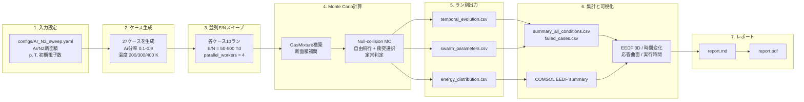

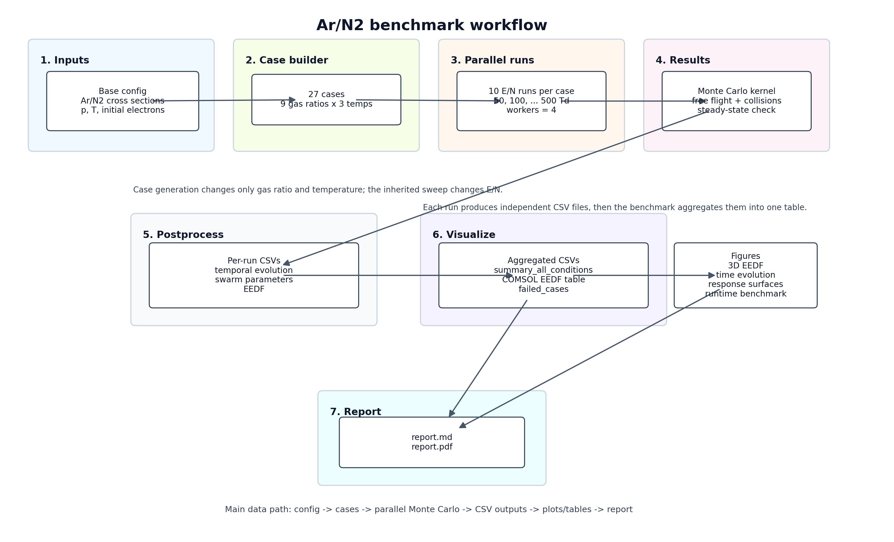

### 4.8 数値計算の工夫と高速化

本コードでは、270 ランのベンチマークを扱うために以下の工夫が入っている。

| 工夫 | 内容 | 効果 |
| --- | --- | --- |
| 条件スイープの並列化 | 各ケース内の 10 個の E/N ランを `parallel_workers = 4` で並列実行。 | 今回の実測で実効 2.05 倍、約 51.1% の時間短縮。 |
| 断面積補間のテーブル化 | 断面積をエネルギー格子上に展開し、衝突確率をベクトル化して評価。 | 反復ステップ内の補間・確率計算の負荷を削減。 |
| velocity LUT | `sqrt(2e epsilon / m_e)` の繰り返し計算をエネルギー格子上の補間で置換可能。 | 多数粒子での速度変換コストを削減。 |
| scatter LUT | 等方散乱の `cos chi` サンプリングを LUT 経由で扱える。 | 散乱角生成のオーバーヘッドを抑制。 |
| max collision LUT | 最大衝突周波数テーブルを圧縮し、時間刻み決定時の補間を軽量化。 | null-collision の `Delta t` 決定を高速化。 |
| EEDF の逐次ヒストグラム加算 | 定常後の各ステップでヒストグラムを累積し、最後に正規化。 | 全粒子履歴を保存せず、メモリ使用量を抑える。 |

今回の生成済みケース YAML では `use_jit` は明示されておらず、設定クラスのデフォルトでは JIT は無効である。一方で LUT 系の既定値は有効であり、主な定量的な高速化としては並列スイープの効果を評価した。JIT カーネル自体は実装されているが、このベンチマーク結果では JIT ON/OFF の A/B 比較は行っていない。

## 5. ベンチマーク結果

### 5.1 完了状況

| 項目 | 結果 |
| --- | ---: |
| ケース数 | 27 |
| E/N ラン数 | 270 |
| 成功ラン | 270 |
| 失敗ケース | 0 |
| 集計ファイル | `outputs/ar_n2_ratio_temp_grid/summary_all_conditions.csv` |
| 誤差列なし集計 | `outputs/ar_n2_ratio_temp_grid/summary_all_conditions_no_error.csv` |
| COMSOL 向け EEDF 集計 | `outputs/ar_n2_ratio_temp_grid/comsol_eedf_summary_all_cases.csv` |

### 5.2 全体統計

| 物理量 | 最小 | 最大 | 平均 |
| --- | ---: | ---: | ---: |
| mean energy `[eV]` | 1.121e0 | 1.032e1 | 6.863e0 |
| bulk drift velocity `[m/s]` | 5.848e4 | 5.048e5 | 2.487e5 |
| flux drift velocity `[m/s]` | 5.911e4 | 4.162e5 | 2.214e5 |
| bulk L diffusion coeff. x N `[m^-1 s^-1]` | 6.046e23 | 5.049e24 | 3.245e24 |
| bulk T diffusion coeff. x N `[m^-1 s^-1]` | 1.635e24 | 5.881e24 | 4.254e24 |
| effective ionization counted `[m^3/s]` | 0.000e0 | 6.750e-15 | 9.502e-16 |
| effective ionization convolution `[m^3/s]` | 0.000e0 | 3.869e-15 | 9.169e-16 |
| attachment counted `[m^3/s]` | 0.000e0 | 0.000e0 | 0.000e0 |
| run time `[s]` | 4.417e0 | 8.321e2 | 3.880e1 |

### 5.3 E/N ごとの平均傾向

全混合比・全温度で平均した値を示す。

| E/N `[Td]` | 平均電子エネルギー `[eV]` | bulk drift velocity 平均 `[m/s]` |
| ---: | ---: | ---: |
| 50 | 2.220 | 7.825e4 |
| 100 | 4.056 | 1.108e5 |
| 150 | 5.520 | 1.506e5 |
| 200 | 6.372 | 1.889e5 |
| 250 | 7.015 | 2.292e5 |
| 300 | 7.552 | 2.647e5 |
| 350 | 8.185 | 3.099e5 |
| 400 | 8.768 | 3.507e5 |
| 450 | 9.215 | 3.840e5 |
| 500 | 9.733 | 4.199e5 |

### 5.4 最大値を与えた条件

| 指標 | 最大条件 | 値 |
| --- | --- | ---: |
| 平均電子エネルギー | `ar08_n202_T200`, 500 Td | 10.321 eV |
| bulk drift velocity | `ar01_n209_T300`, 500 Td | 5.048e5 m/s |
| effective ionization convolution | `ar09_n201_T200`, 500 Td | 3.869e-15 m3/s |
| run time | `ar08_n202_T400`, 500 Td | 832.130 s |

### 5.5 高速化・実行時間

各ケース内で `parallel_workers = 4` により E/N ランを並列化した。270 ランの個別実行時間を単純合計した値と、各ケースの並列スイープ実測時間を合計した値を比較する。

| 項目 | 値 |
| --- | ---: |
| 個別ラン数 | 270 |
| 個別ラン時間の合計 | 10475.060 s |
| 個別ラン平均時間 | 38.797 s |
| 個別ラン最短 | 4.417 s |
| 個別ラン最長 | 832.130 s |
| 並列ケース実測時間の合計 | 5120.509 s |
| ケース平均実測時間 | 189.648 s |
| 実効高速化率 | 2.046 x |
| 時間短縮率 | 51.117% |

高 E/N 側では平均電子エネルギーと電離レートが大きくなり、電子数増加や収束に必要なサンプルが増えるため、実行時間も増加しやすい。

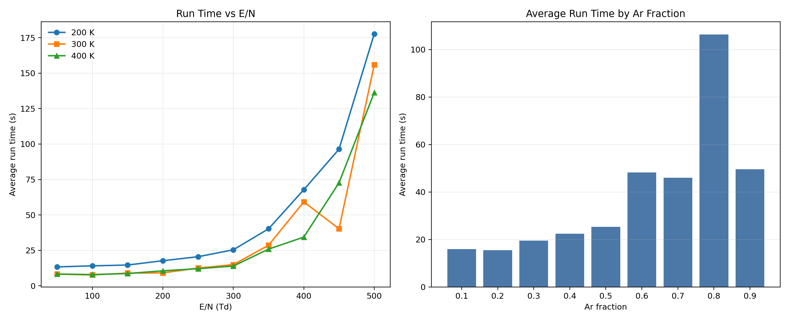

### 5.6 物性・EEDF の可視化

代表条件 `Ar=0.6, N2=0.4, T=300 K, E/N=300 Td` の時間発展を示す。平均エネルギーは初期加速後に定常値へ近づき、速度と位置分散も電界方向に応答する。

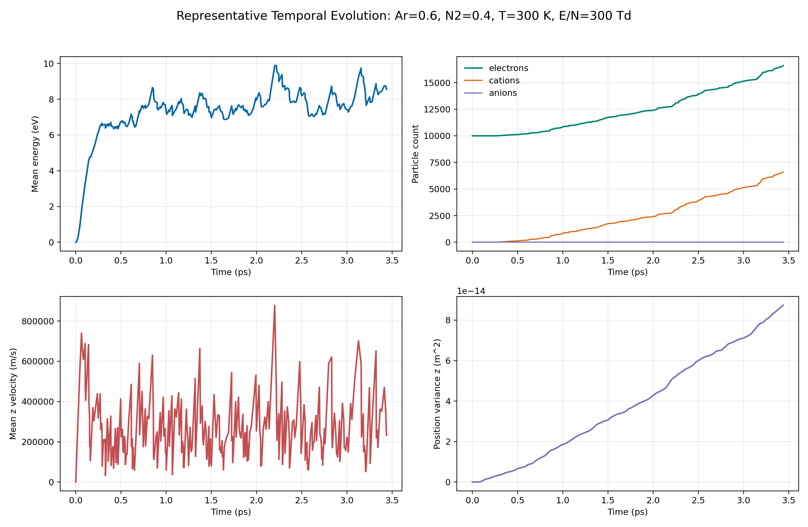

同じ混合比・温度における E/N ごとの時間平均 EEDF を示す。E/N が高くなるほど高エネルギー側の裾が伸び、電離反応に寄与する電子が増える。

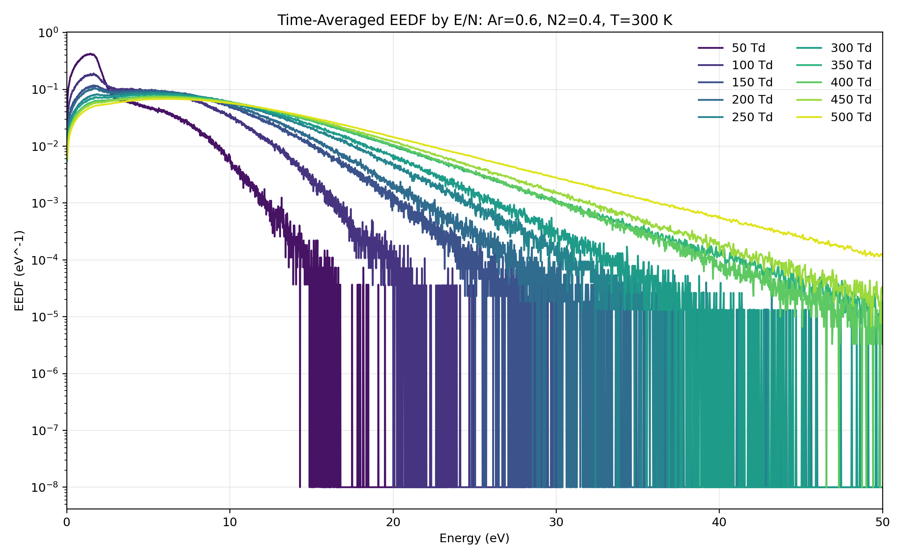

平均エネルギーとエネルギーを軸にした EEDF の 3D 表示を示す。縦軸は `log10(EEDF)` であり、低確率の高エネルギー裾も見やすくしている。

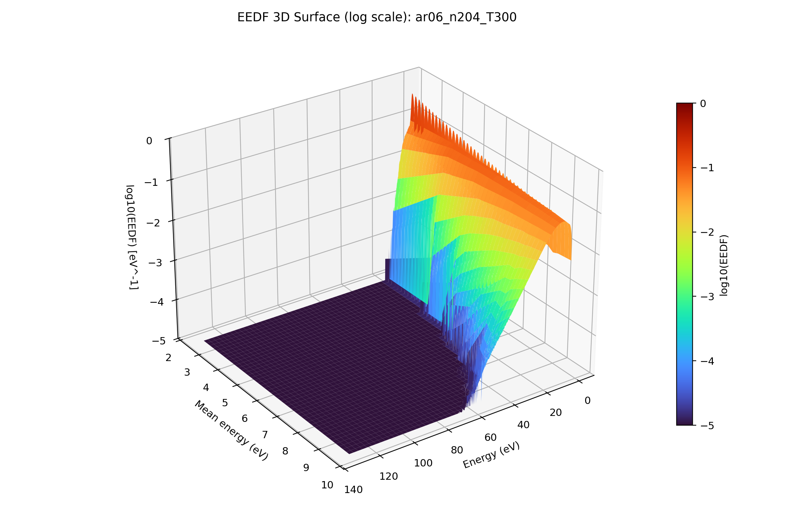

線表示版の 3D Plot は、EEDF の稜線構造と高エネルギー側の減衰を確認しやすい。

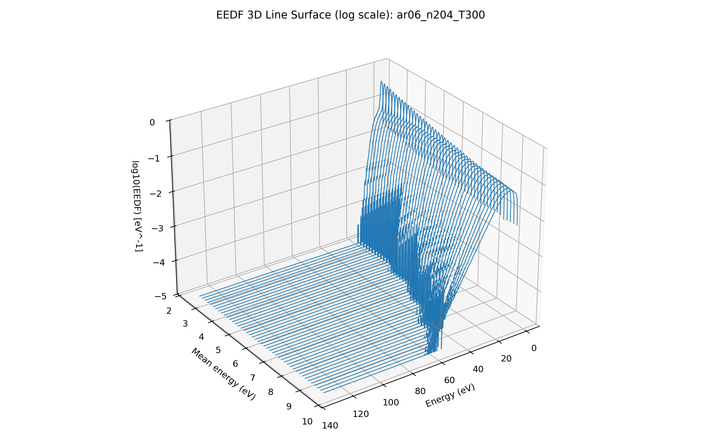

ヒートマップ表示では、EEDF のピーク位置と高エネルギー裾の広がりを俯瞰できる。

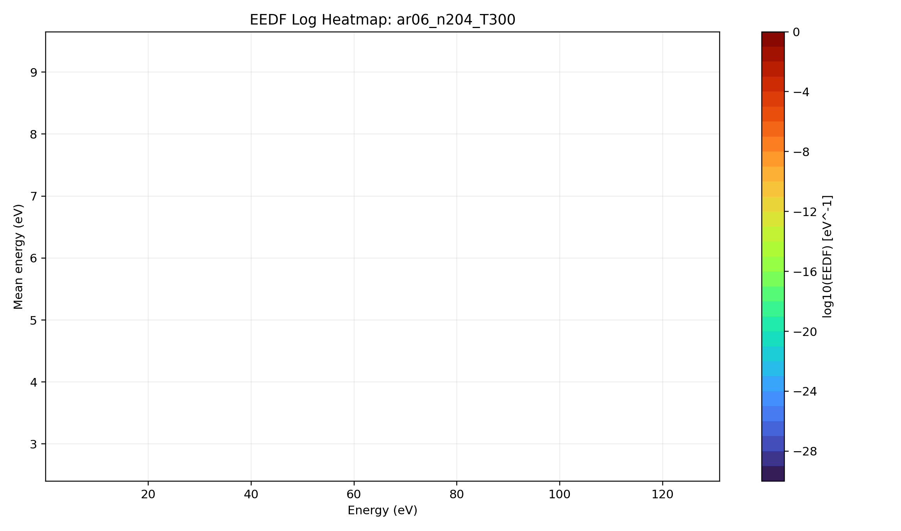

`E/N = 300 Td` に固定し、Ar 分率と温度に対する応答曲面を示す。平均エネルギー、bulk drift velocity、拡散係数、畳み込み電離レートの依存性をまとめて確認できる。

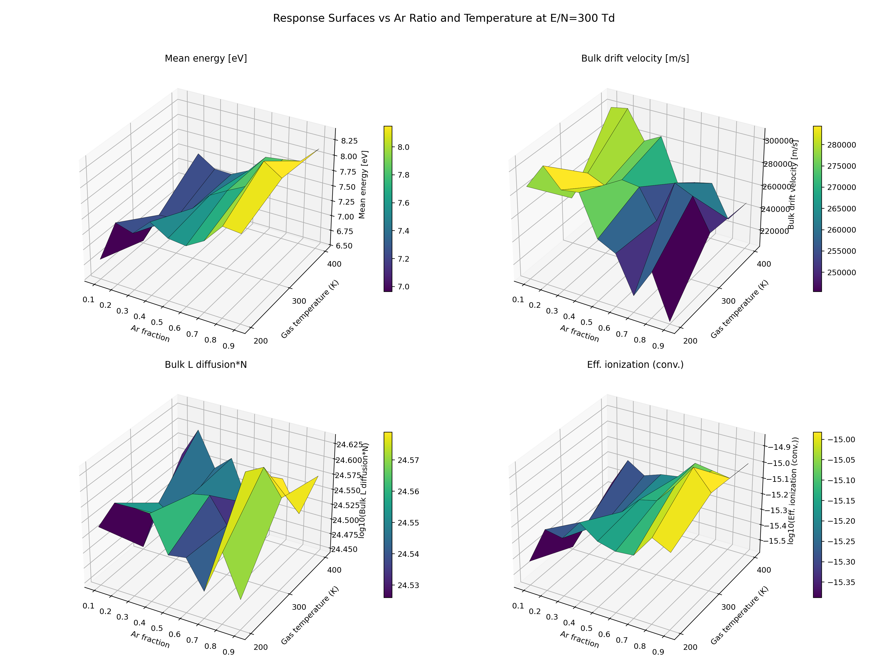

同じ情報のヒートマップ版を示す。温度・混合比による局所的な変化を比較しやすい。

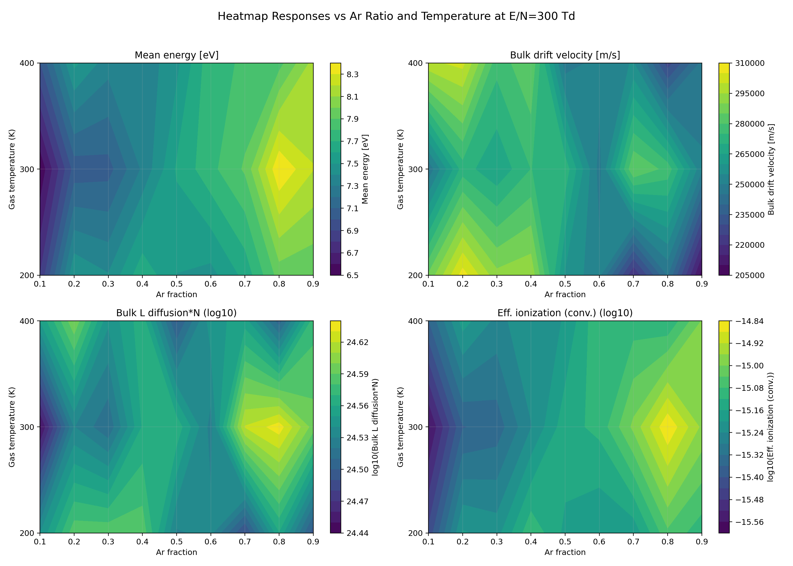

全温度・全 Ar 分率に対する E/N トレンドを示す。上段が平均電子エネルギー、下段が畳み込みによる実効電離レートである。

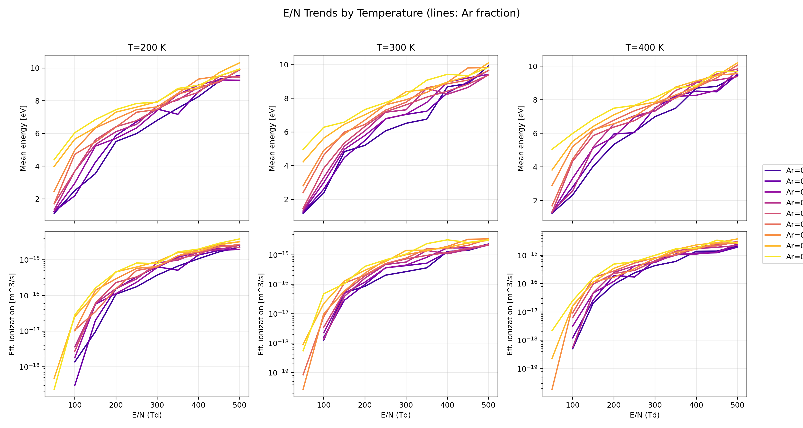

輸送係数の E/N トレンドを示す。bulk drift velocity は E/N とともに増加し、拡散係数も高 E/N 側で大きくなる。

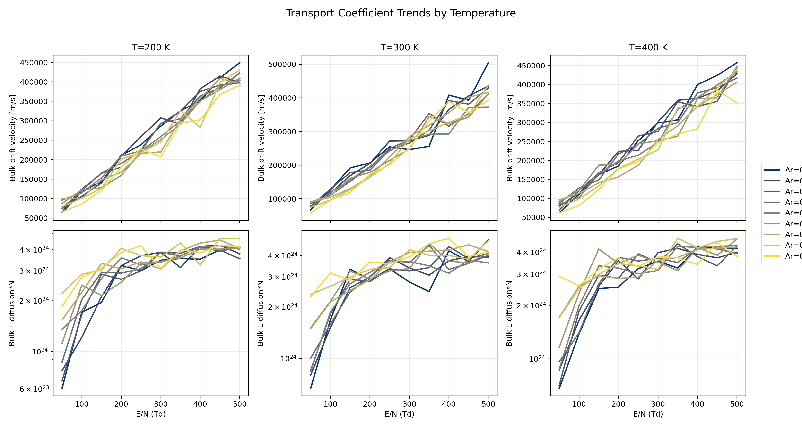

## 6. 考察

### 6.1 物理傾向

平均電子エネルギーは E/N とともに単調に増加した。全条件平均では、50 Td で 2.220 eV、500 Td で 9.733 eV であり、約 4.4 倍に増加している。bulk drift velocity も 50 Td の 7.825e4 m/s から 500 Td の 4.199e5 m/s へ増加した。

電離レートは低 E/N 側では 0 または非常に小さく、高 E/N 側で顕著に増加した。最大の畳み込み実効電離レートは `ar09_n201_T200`, 500 Td の 3.869e-15 m3/s であった。今回の Ar/N2 断面積セットでは attachment は全条件で 0 であり、実効電離は電離レートと一致する。

EEDF は E/N 上昇に伴って高エネルギー側へ広がる。これは、平均エネルギー増加、電離レート増加、実行時間増加と整合的である。高 E/N では電離イベントが増え、粒子数や統計的なばらつきも増えやすくなるため、計算負荷が大きくなったと考えられる。

### 6.2 計算性能

270 ラン全体では、個別ラン時間の合計 10475.060 s に対し、ケース内並列化後の実測合計は 5120.509 s であった。実効高速化率は 2.046 倍、時間短縮率は 51.117% である。

4 worker に対して理想的な 4 倍に達していない理由として、各 E/N ランの実行時間が大きく異なることが挙げられる。特に 500 Td 付近の高負荷ランが支配的になるため、最後に残った重いランがケース全体の wall time を決める。したがって、さらなる高速化には、E/N ごとの負荷を考慮したジョブスケジューリング、ケース横断での並列投入、または JIT 有効化の A/B 評価が有効である。

### 6.3 数値上の注意点

本結果は Monte Carlo 統計に基づくため、輸送係数とレート係数には統計誤差がある。`summary_all_conditions.csv` には誤差列も含まれているため、厳密な条件比較では平均値だけでなく誤差も確認する必要がある。

また、今回の代表図で示した EEDF は定常後の時間平均 EEDF であり、時々刻々の瞬時 EEDF を保存したものではない。EEDF の時間発展を直接議論するには、Instantaneous EEDF を一定間隔で保存する追加出力が必要である。

今回の設定では等方散乱を使っている。異方性散乱や別の断面積セットを使うと、高エネルギー側の輸送係数や EEDF が変化する可能性がある。さらに、JIT カーネルは実装されているが、このベンチマークの YAML では `use_jit` が明示されていないため、JIT による高速化効果はこのレポートでは定量評価していない。

### 6.4 今後の改善案

今後のベンチマークでは、以下を追加すると第三者検証性が高まる。

| 改善案 | 目的 |
| --- | --- |
| JIT ON/OFF の A/B 実行 | LUT と JIT の高速化効果を分離して定量化する。 |
| Boltzmann solver との比較 | MC 結果の物理妥当性を検証する。 |
| 瞬時 EEDF 保存 | EEDF の時間発展を直接可視化する。 |
| 実験値・文献値との比較 | Ar/N2 輸送係数の絶対値検証を行う。 |
| 高 E/N の粒子数制御感度 | 電離による粒子数増加が統計・実行時間へ与える影響を調べる。 |

## 7. 参照ファイル

| 種別 | パス |
| --- | --- |
| ベース設定 | `configs/Ar_N2_sweep.yaml` |
| グリッド実行スクリプト | `benchmarks/run_ar_n2_ratio_temp_grid.py` |
| 集計結果 | `outputs/ar_n2_ratio_temp_grid/summary_all_conditions.csv` |
| 誤差列なし集計 | `outputs/ar_n2_ratio_temp_grid/summary_all_conditions_no_error.csv` |
| 失敗ケース一覧 | `outputs/ar_n2_ratio_temp_grid/failed_cases.csv` |
| 実行ログ | `outputs/ar_n2_ratio_temp_grid/run_grid.log` |
| COMSOL 向け EEDF | `outputs/ar_n2_ratio_temp_grid/comsol_eedf_summary_all_cases.csv` |
| 図 | `outputs/ar_n2_ratio_temp_grid/plots/` |
