# swarmBoltzmann / swarm_mc 統合コード報告書

本書は、`electron_swarm` によるネイティブ Boltzmann 2 項近似ソルバーと、既存 `swarm_mc` 粒子モンテカルロソルバーを同一ワークフローで扱う本コードについて、理論、実装、ベンチマーク、および既存計算結果の考察をまとめたものである。  
対象とした主な既存計算結果は以下である。

| 種別 | 設定ファイル / 出力 |
| --- | --- |
| Ar 比較 | `configs/unified/both_template.yaml` |
| Ar/N2 比較 | `configs/unified/ar_n2_both.yaml` |
| BOLSIG+ ベンチマーク | `outputs/benchmarks/ar_n2_bolsig/` |

## 本コードの概要

本コードは、電子スウォーム輸送係数と EEDF を、同一の断面積入力と共通出力形式で評価するための統合基盤である。中核は次の 2 系統で構成される。

- `electron_swarm`: solver-neutral な設定、断面積読込、Boltzmann 2 項近似、共通出力、可視化
- `swarm_mc`: 既存の粒子モンテカルロ計算エンジン

この統合により、同一条件で

- Boltzmann 2 項近似のみ
- Monte Carlo のみ
- 両者を同時実行して比較

を切り替えられる。さらに、出力は unified schema に加えて `summary.csv` / `eedf_table.csv` 互換も維持しているため、既存 downstream と接続したまま新しい比較ワークフローを導入できる。

主要モジュールの役割を表 1 に示す。

| モジュール | 役割 |
| --- | --- |
| `electron_swarm/core/config.py` | unified YAML の読込と検証 |
| `electron_swarm/core/cross_sections.py` | CSV / LXCat / BOLSIG 形式の断面積統一読込 |
| `electron_swarm/solvers/boltzmann_two_term.py` | ネイティブ Boltzmann 2 項近似ソルバー |
| `electron_swarm/solvers/monte_carlo_adapter.py` | `swarm_mc` を unified schema に接続 |
| `swarm_mc/unified_adapter.py` | 既存 MC 結果を `SwarmCaseResult` に変換 |
| `electron_swarm/io/writers.py` | unified CSV と legacy CSV の同時出力 |
| `electron_swarm/plotting.py` | 輸送係数比較図と EEDF 図の出力 |

## 本コードが必要な背景と目的

プラズマ輸送・放電シミュレーションでは、電子輸送係数、反応係数、EEDF を高い一貫性で評価する必要がある。代表的な実務上の課題は次の通りである。

- BOLSIG+ は優れた参照コードだが、外部ツールであり、既存 MC コードと入力・出力形式が分離しやすい
- 粒子 Monte Carlo は物理的に直接的だが計算コストが高く、統計誤差や sweep の管理が必要になる
- ボルツマン法と MC 法で断面積セットや出力定義が少しでもずれると、「数値実装の差」と「物理モデルの差」を切り分けにくい
- 既存 downstream が `summary.csv` や `eedf_table.csv` に依存している場合、解析基盤を更新しにくい

そこで本コードの目的は、次の 4 点にある。

1. 同じ断面積ファイルを Boltzmann と Monte Carlo の両方で使うこと
2. 同じ E/N sweep と同じ出力定義で両者を直接比較すること
3. BOLSIG+ に整合する native two-term solver を repo 内に持つこと
4. 既存の可視化・最適化・COMSOL 向けワークフローを壊さないこと

## 本コードの全体の構成、ワークフロー

本コードの実行フローを図 1 に示す。

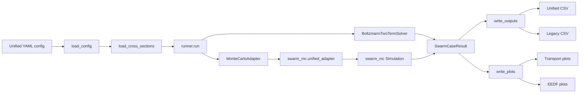

実行の考え方はシンプルである。

1. YAML からガス組成、E/N sweep、断面積、各 solver の制御パラメータを読む
2. 断面積は `electron_swarm/core/cross_sections.py` で統一形式へ変換する
3. `run.mode` に応じて Boltzmann、MC、または両方を走らせる
4. 各 solver の結果を `SwarmCaseResult` にそろえる
5. unified CSV、legacy CSV、比較グラフ、EEDF グラフを出力する

この構成の重要点は、Boltzmann と MC を別々のスクリプトで扱うのではなく、同じ `runner` と同じ結果オブジェクトで管理していることである。これにより、比較時のファイル変換や手作業が大きく減る。

## 本コードでのボルツマン 2 項近似の理論

### 1. 基本近似

一様 DC 電場下で電子速度分布関数を方向余弦 $\mu = \cos \theta$ に関して 2 項まで展開する。

$$
f(v,\mu) = f_0(v) + \mu f_1(v)
$$

本コードでは、計算の主変数として規格化されたエネルギー分布関数 $F(\varepsilon)$ を用いる。

$$
\int_0^\infty F(\varepsilon)\, d\varepsilon = 1
$$

非保存過程を含む場合、定常問題は時間成長率 $\lambda$ をもつ固有値問題として扱う。

$$
\mathcal{L}[F] = \lambda F
$$

ここで $\mathcal{L}$ はエネルギー空間の加熱・散乱・非保存衝突を含む作用素である。

### 2. エネルギー空間フラックス

エネルギー空間の流束を

$$
J(\varepsilon) = A(\varepsilon) F(\varepsilon) - D(\varepsilon)\frac{dF}{d\varepsilon}
$$

と書き、有限体積法で離散化する。本コードでは Scharfetter-Gummel 型の指数フィッティングを用いており、局所 Peclet 数が大きい場合でも EEDF の負値化や数値振動を抑えやすい。

電場加熱に対応するエネルギー拡散係数は、BOLSIG 型の表式に対応する

$$
D_{\mathrm{field}}(\varepsilon)
=
\frac{2}{3}\frac{(eE)^2}{m_e}\frac{\varepsilon_J}{\nu_m(\varepsilon)e^2}
$$

で与えられる。本コードではこれを eV 基準の係数へ換算して実装している。弾性衝突に対しては Fokker-Planck 型のエネルギー交換項を採用している。

$$
D_{\mathrm{el}} = 2\frac{m_e}{M}\nu_m \varepsilon kT_g
$$

$$
A_{\mathrm{el}} = 2\frac{m_e}{M}\nu_m\left(\frac{1}{2}kT_g - \varepsilon\right)
$$

### 3. 有効運動量移行断面積

今回の native solver では、BOLSIG+ と整合するように輸送計算で使う $\sigma_m^{\mathrm{eff}}$ を見直している。すなわち、種ごとに `EFFECTIVE` 断面積がある場合はそれを優先し、ない場合には elastic/momentum だけでなく inelastic 過程も輸送衝突周波数へ寄与させる。

$$
\nu_m(\varepsilon)
=
N\, v(\varepsilon)\sum_i x_i \sigma_{m,i}^{\mathrm{eff}}(\varepsilon)
$$

この修正により、Ar/N2 の native solver は BOLSIG+ に対して輸送係数でほぼ重なる結果となった。

### 4. 非弾性・非保存衝突

本コードは以下を sparse source/sink operator として組み立てる。

- 励起
- 超弾性衝突
- 電離
- 付着

電離については、余剰エネルギーの分配モデルを切り替えられる。

- `equal`: 2 電子で等分
- `primary_secondary`: 1 本を冷たい secondary として扱う
- `loss_only`: エネルギー損失のみ

### 5. 輸送係数

2 項近似の異方成分から flux 輸送係数を評価する。実装上の中心式は次である。

$$
\mu N
=
-\frac{e}{3m_e}
\int_0^\infty
\left[
\frac{2\varepsilon}{\nu_m/N}\frac{dF}{d\varepsilon}
-
\frac{F}{\nu_m/N}
\right]
d\varepsilon
$$

$$
DN
=
\frac{1}{3}
\int_0^\infty
\frac{v^2}{\nu_m/N}F(\varepsilon)\, d\varepsilon
$$

$$
W = (\mu N)\left(\frac{E}{N}\right)
$$

本コードの shared schema では Boltzmann 側の diffusion は scalar two-term diffusion を `diffusion_L` / `diffusion_T` の両方へ格納している。この点は MC 側の真の異方拡散との比較で注意が必要である。

## 本コードでのモンテカルロの理論

### 1. 基本アルゴリズム

`swarm_mc` は電子群を粒子として追跡する。自由飛行と衝突を交互に扱う null-collision 法が中核である。時間刻みは trial collision frequency $\nu_{\mathrm{trial}}$ を使って

$$
\Delta t = -\frac{\ln \xi}{\nu_{\mathrm{trial}}}
$$

と選ぶ。ここで $\xi$ は一様乱数である。

粒子運動は電場加速の下で

$$
\mathbf{v}_{n+1}
=
\mathbf{v}_n + \frac{q\mathbf{E}}{m_e}\Delta t
$$

$$
\mathbf{r}_{n+1}
=
\mathbf{r}_n + \mathbf{v}_n \Delta t + \frac{1}{2}\frac{q\mathbf{E}}{m_e}\Delta t^2
$$

として更新される。

### 2. 衝突選択

各過程の衝突周波数 $\nu_k(\varepsilon)$ に対し、

$$
P_k = \frac{\nu_k(\varepsilon)}{\nu_{\mathrm{trial}}}
$$

で衝突種を選び、残りを null collision とする。散乱角は等方モデルまたは異方モデルでサンプリングされる。

### 3. 輸送係数

MC では bulk と flux の両方の輸送係数をもともと計算している。

bulk drift velocity は swarm 重心の時間変化で、

$$
W_{\mathrm{bulk}} = \frac{d\langle z\rangle}{dt}
$$

bulk diffusion は位置分散から

$$
D_{\mathrm{bulk}}N = \frac{N}{2}\frac{d\,\mathrm{Var}(z)}{dt}
$$

として評価される。

一方、flux drift velocity は速度平均であり、

$$
W_{\mathrm{flux}} = \langle v_z \rangle
$$

flux diffusion は

$$
D_{\mathrm{flux}}N
=
N\left(\langle z v_z \rangle - \langle z \rangle \langle v_z \rangle\right)
$$

に相当する量から評価される。本統合コードでは primary な drift と diffusion に flux 系を採用し、bulk 値は metadata 側へ保持している。

### 4. EEDF と定常判定

EEDF は steady-state 到達後の時間平均ヒストグラムから求める。steady-state 判定は平均電子エネルギーのトレンドと残差分散を sliding window で監視する方法が実装されている。これにより、単一時刻の瞬間分布ではなく、SST 後の統計平均として EEDF と輸送係数を取得できる。

## 本コードでの高速化

高速化は Boltzmann 側と MC 側の両方に入っている。代表的な項目を表 2 に示す。

| 項目 | 対象 | 内容 |
| --- | --- | --- |
| 二次エネルギー格子 | Boltzmann | 低エネルギー側の分解能を高く保ちつつ条件数悪化を抑える |
| 適応上限エネルギー | Boltzmann | tail probability と edge-to-peak を見て格子上限を自動拡張 |
| sparse 行列化 | Boltzmann | 近接結合主体の作用素を疎行列として構成し、線形代数を軽量化 |
| Scharfetter-Gummel | Boltzmann | 中心差分より安定にエネルギー空間フラックスを離散化 |
| velocity LUT | MC | `velocity_from_energy` を cross-section grid 上で前計算 |
| scattering LUT | MC | 等方散乱の逆 CDF を LUT 化 |
| anisotropic LUT | MC | 異方散乱の cos χ をエネルギー依存 2D LUT 化 |
| max-collision LUT | MC | 累積最大衝突周波数を圧縮表にし、timestep 決定を軽量化 |
| optional numba JIT | MC | timestep、散乱方向、衝突分類、エネルギー損失、ヒストグラム更新を高速化 |
| Python API adapter | ワークフロー | subprocess を介さず unified runner から直接 MC を呼ぶ |

Boltzmann 側では、単に「速い」だけでなく、解の安定性も高速化戦略に含まれている。特に adaptive grid と Scharfetter-Gummel は、反復回数や再実行の削減にも効いている。

MC 側では、ホットパスを次のように削減している。

- `determine_timestep_jit` による null-collision timestep 決定の高速化
- `unit_scattered_velocity_jit` による散乱方向生成の高速化
- `histogram_increment_jit` による EEDF ヒストグラム更新の高速化
- LUT による補間主体への置換

したがって、本コードの高速化は「理論式の簡略化」ではなく、「同じ物理モデルをできるだけ安く・安定に解く」方向で設計されている。

## BOLSIG とのベンチマーク結果

### 1. ベンチマーク条件

ベンチマークは Ar/N2 = 30/70、300 K、1 MPa、50--300 Td で行った。比較対象は公式 BOLSIG+ であり、ベンチマーク用コードや外部バイナリ自体は本体ワークフローには組み込んでいない。すなわち、本レポートで示す BOLSIG 比較はあくまで検証用である。

### 2. 定量結果

表 3 に native Boltzmann solver の BOLSIG+ に対する相対誤差を示す。

| E/N [Td] | 平均エネルギー誤差 [%] | muN 誤差 [%] | DN 誤差 [%] |
| --- | ---: | ---: | ---: |
| 50 | +0.119 | -0.125 | -0.011 |
| 100 | +0.098 | -0.080 | +0.016 |
| 150 | +0.053 | -0.058 | +0.031 |
| 200 | +0.054 | -0.034 | +0.100 |
| 250 | +0.105 | +0.069 | +0.264 |
| 300 | +0.071 | +0.212 | +0.399 |
| 最大絶対値 | 0.119 | 0.212 | 0.399 |

native solver の輸送係数は、BOLSIG+ に対して平均エネルギーで最大 0.119 %、$\mu N$ で 0.212 %、$DN$ で 0.399 % の差に収まっている。これは本コードの native two-term 実装が、少なくとも今回の Ar/N2 条件では BOLSIG+ と実質的に同等の two-term 解を返していることを示す。

### 3. グラフ

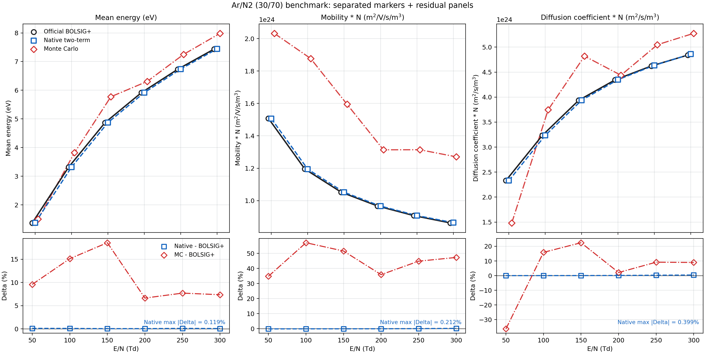

図 2 では、黒丸の BOLSIG+ と青四角の native two-term が全指標でほぼ重なっている。一方、赤菱形の Monte Carlo は平均エネルギー、移動度、拡散で系統的に離れている。したがって、MC との差が大きいからといって native Boltzmann の輸送積分実装が誤っているとは言えず、むしろ two-term 近似と particle MC の物理モデル差が主要因であると解釈できる。

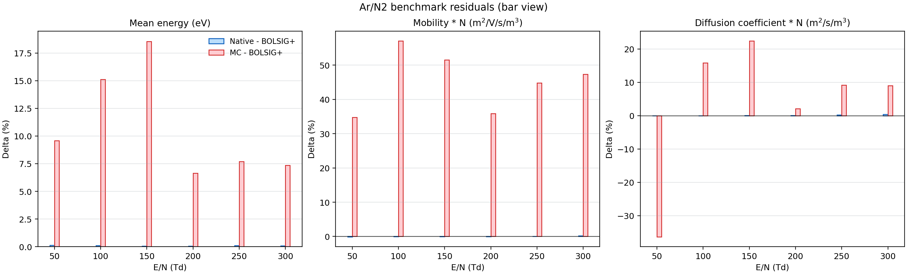

図 3 の残差パネルからも、native solver の誤差は全点で 1 % 未満、実際には 0.4 % 未満であることが確認できる。これに対し MC は 10--50 % 台のずれを示しており、BOLSIG 基準で見たときの差の支配要因は solver bug ではなく solver physics の違いである。

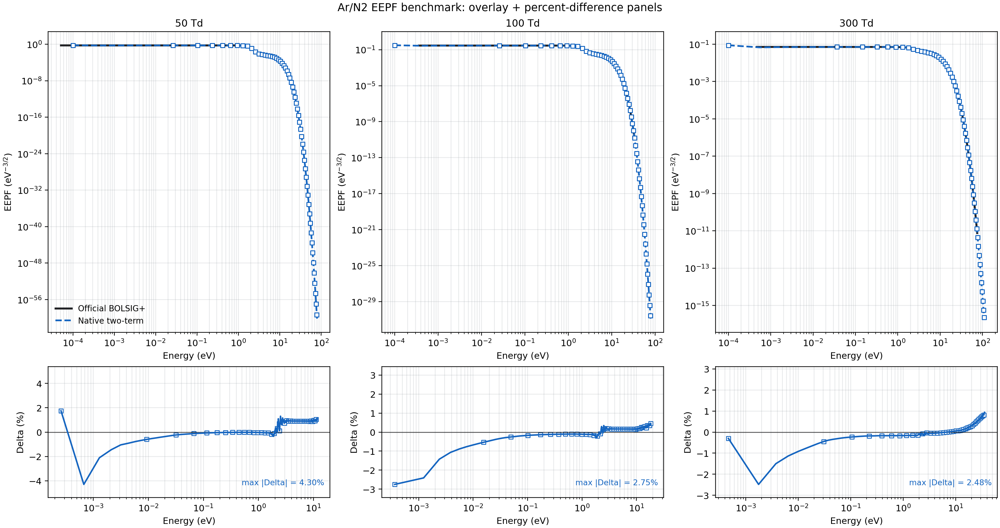

図 4 の EEPF 比較でも native solver は BOLSIG+ と実質的に一致している。したがって、今回導入した effective transport cross section の整理と輸送積分の修正は妥当であったと言える。

> 注意: `ar_n2_both.yaml` の unified 実行では 50 Td 点に `meta_converged=False` が残っているが、BOLSIG+ との数値差は依然として非常に小さい。したがって、この flag は low-field 条件の収束判定がやや保守的であることを示している可能性が高い。

## Ar ガスでのボルツマン 2 項近似とモンテカルロ計算結果比較

### 1. 計算条件

Ar 比較は `configs/unified/both_template.yaml` を用いた。条件は Ar 100 %、300 K、1 MPa、E/N = 50, 100, 200 Td である。

### 2. 定量比較

表 4 に、Boltzmann 値の MC 値に対する相対差

$$
\Delta[\%] = 100\left(\frac{\mathrm{Boltzmann}}{\mathrm{MC}} - 1\right)
$$

を示す。

| E/N [Td] | 相対差 平均エネルギー [%] | 相対差 drift velocity [%] | 相対差 D_LN [%] | 相対差 nu_eff [%] |
| --- | ---: | ---: | ---: | ---: |
| 50 | -0.9 | -33.1 | +50.9 | -52.2 |
| 100 | +0.5 | -27.4 | +58.1 | -4.6 |
| 200 | -4.5 | -35.3 | +20.1 | -44.8 |

平均エネルギーはかなり近い一方で、drift velocity と移動度は Boltzmann が一貫して 27--35 % 低い。拡散係数は逆に Boltzmann が 20--58 % 高い。したがって、Ar 単体では「EEDF の代表値」は近いが、「輸送モーメント」はかなり離れている。

### 3. グラフ

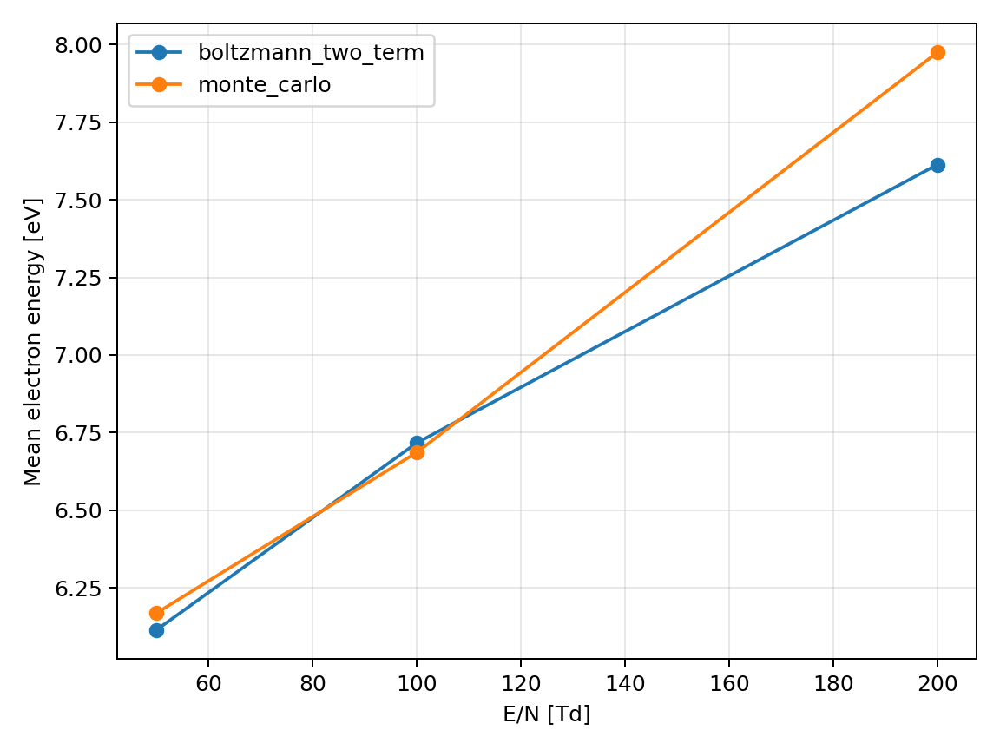

図 5 では、平均電子エネルギーは 50--100 Td でほぼ一致し、200 Td でのみ MC がやや高くなる。EEDF 全体の加熱傾向そのものは両 solver で同じ方向を向いていることが分かる。

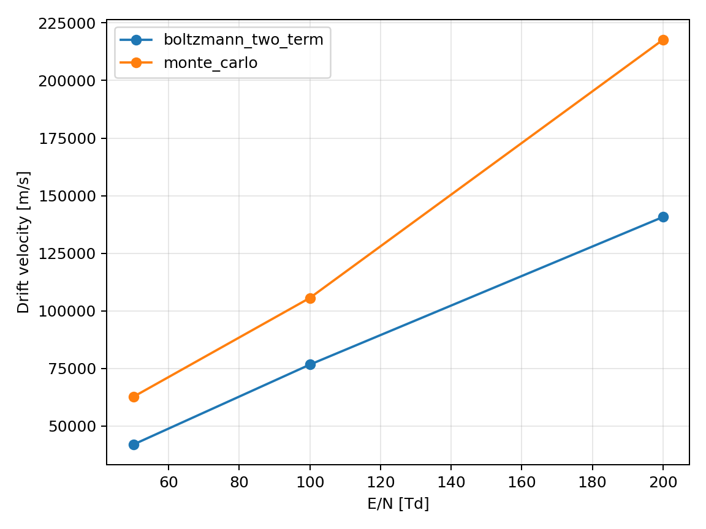

図 6 では、drift velocity は全点で MC が大きい。しかも差はほぼ並行移動ではなく、E/N とともに開く。このことは、純粋なスケーリング誤差ではなく、速度空間の異方性や運動量移行の扱いの違いが効いていることを示唆する。

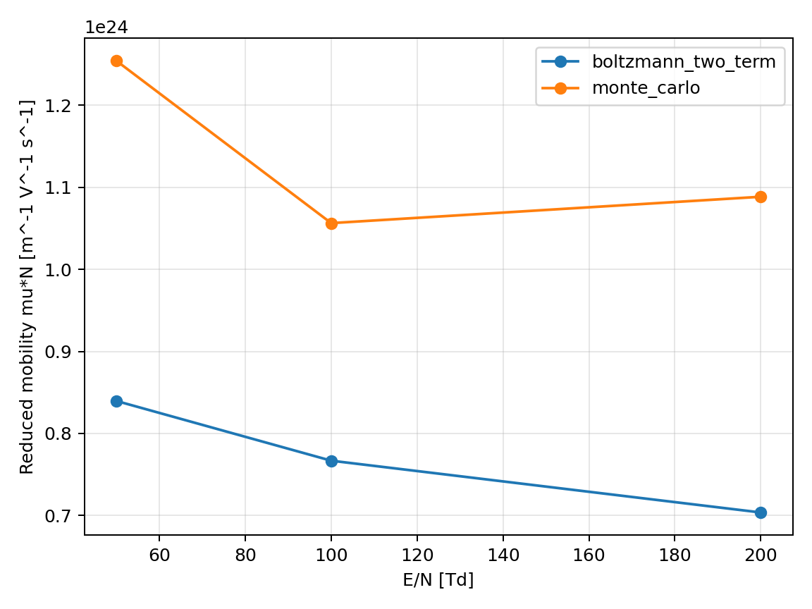

図 7 でも $\mu N$ は MC が一貫して高い。平均エネルギーが近いにもかかわらず移動度が大きく違うため、差の本質は「どのエネルギーにどれだけ粒子がいるか」だけでなく、「異方成分 $f_1$ の表現能力」にあると考えられる。

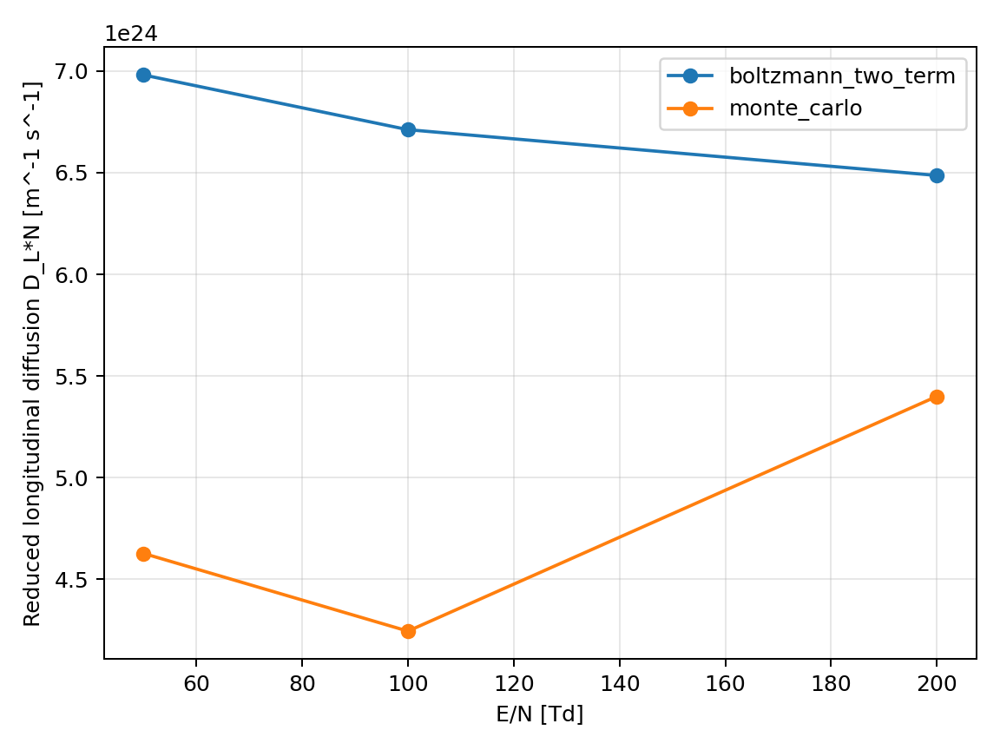

図 8 では、Boltzmann の $D_LN$ は単調にやや減少し、MC は 100 Td で底を持って 200 Td で再び増加している。形の違いも大きく、Ar 単体では二者の拡散描像がかなり異なる。

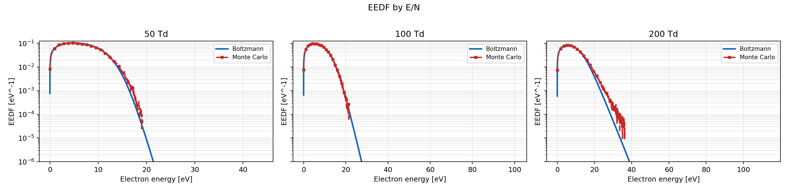

図 9 の EEDF では、低エネルギー側のピーク位置は近いが、MC の高エネルギー tail が Boltzmann より長く残る傾向が見える。特に 200 Td ではこの tail の違いが drift velocity と移動度差に対応していると解釈しやすい。

### 4. 考察

Ar 単体の結果から言えることは次の通りである。

- native Boltzmann solver 自体は BOLSIG+ と整合しているため、Ar の MC 差は Boltzmann 実装バグでは説明しにくい
- 平均エネルギーが近くても drift / mobility / diffusion は大きく違い得る
- 純 Ar では two-term 近似の限界、異方散乱モデル、MC 側の統計ばらつきが相対的に強く現れている可能性が高い

したがって、Ar では「平均エネルギーは整合的、輸送係数は保守的に解釈すべき」というのが現時点で最も妥当な読み方である。

## Ar/N2 ガスでのボルツマン 2 項近似とモンテカルロ計算結果比較

### 1. 計算条件

Ar/N2 比較は `configs/unified/ar_n2_both.yaml` を用いた。条件は Ar/N2 = 30/70、300 K、1 MPa、E/N = 50, 100, 150, 200, 250, 300 Td である。

### 2. 定量比較

表 5 に Boltzmann と MC の相対差を示す。

| E/N [Td] | 相対差 平均エネルギー [%] | 相対差 drift velocity [%] | 相対差 D_LN [%] | 相対差 nu_eff [%] |
| --- | ---: | ---: | ---: | ---: |
| 50 | -8.6 | -25.9 | +57.2 | -- |
| 100 | -13.0 | -36.4 | -13.7 | -79.0 |
| 150 | -15.6 | -34.1 | -18.3 | -76.5 |
| 200 | -6.2 | -26.4 | -2.0 | -39.8 |
| 250 | -7.1 | -30.9 | -8.2 | -49.4 |
| 300 | -6.8 | -32.0 | -7.9 | -37.3 |

Ar/N2 では平均エネルギーは Boltzmann が 6--16 % 低く、drift velocity は 26--36 % 低い。拡散係数差は 200 Td 以上でかなり縮まっているが、ionization-related frequency は MC の方がかなり大きい。

### 3. グラフ

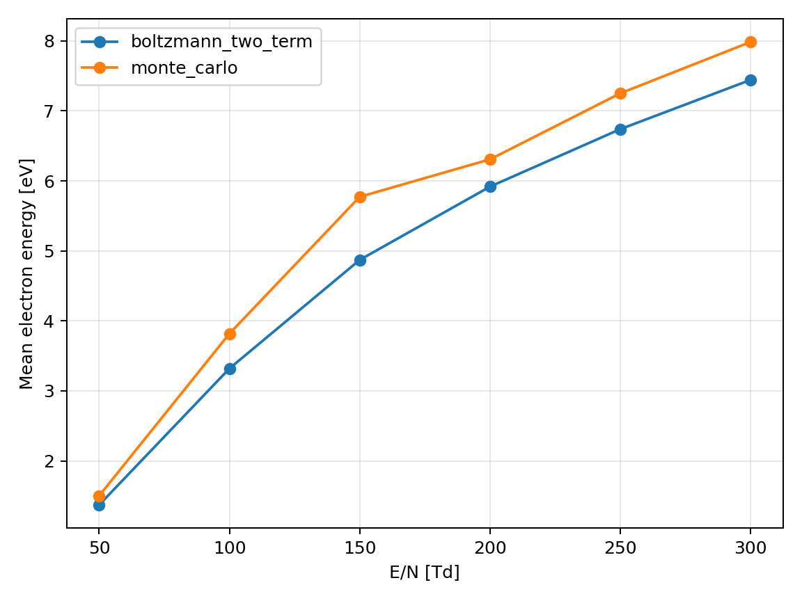

図 10 では、両 solver とも E/N の増加に対して平均エネルギーが単調に上昇する。したがって加熱トレンド自体は整合しているが、MC の方が全域で高エネルギー寄りである。

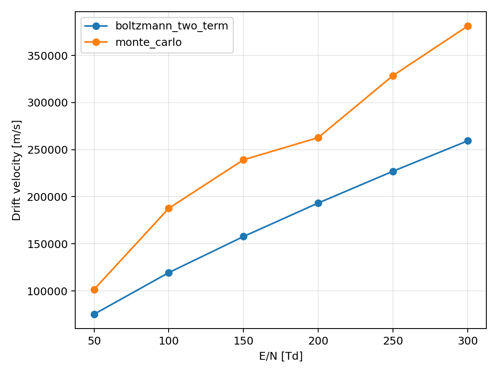

図 11 では、drift velocity は全点で MC が上回り、その差はほぼ一定割合で残る。これは Ar/N2 混合気体でも、two-term 近似が異方性をやや抑え気味に見積もっている可能性を示唆する。

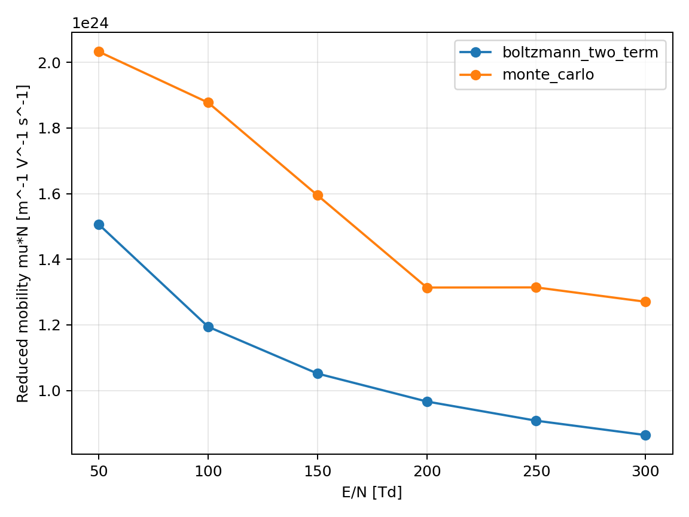

図 12 の $\mu N$ も drift velocity と同様に MC が高い。BOLSIG+ に対して native solver がほぼ一致している事実を踏まえると、この差は「Boltzmann 実装の誤差」ではなく「Boltzmann vs particle MC」の差として読むべきである。

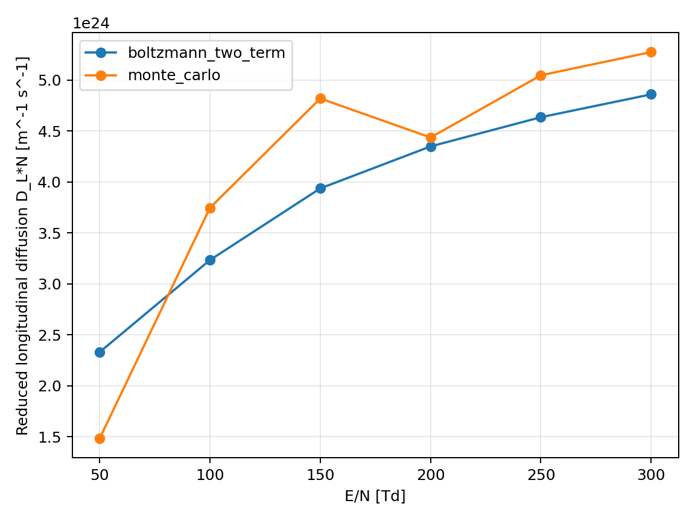

図 13 では、50 Td では Boltzmann の拡散が高く、100--300 Td ではむしろ MC が高い。200 Td 付近で両者はかなり近づく。したがって Ar/N2 では拡散係数の差は単純な定数倍ではなく、E/N に依存して符号まで変わる。

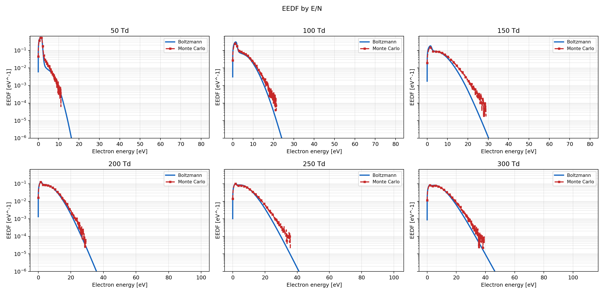

図 14 の EEDF では、今回の描画は E/N ごとのサブプロット、縦軸下限 $10^{-6}$、MC が 0 になった地点で打ち切る形式に整理されている。そのため、同一条件での比較がかなり見やすい。図を見ると、MC の tail は Boltzmann よりも全般に長く、100 Td 以上では中高エネルギー成分が相対的に多い。この差が drift velocity と ionization frequency の差に対応していると考えられる。

### 4. 考察

Ar/N2 の比較から得られる重要な点は次の 3 点である。

1. native two-term solver は BOLSIG+ とほぼ一致している  
   したがって、Ar/N2 での MC との差は輸送積分の実装不良では説明しにくい。

2. MC は一貫してより速い輸送を示す  
   drift velocity と移動度が全域で大きいことから、粒子法で表現される異方性や高エネルギー tail が two-term より強く出ている可能性が高い。

3. 拡散は Ar 単体より整合的である  
   200 Td 以上で $D_LN$ の差が数 % 程度まで縮んでおり、混合気体では two-term scalar diffusion が比較的よく効いている領域がある。

一方で、effective ionization frequency は依然として大きく異なる。これは、EEDF tail の違いが電離しきい値近傍の感度を強く増幅していることを意味する。したがって、反応係数を主目的に使う場合には、MC と two-term の両方を見ながら使うのが安全である。

## まとめ

本コードの要点は以下に整理できる。

- 本コードは、Boltzmann 2 項近似と粒子 Monte Carlo を同じ断面積、同じ設定、同じ出力形式で比較できる統合基盤である
- native Boltzmann solver は、Ar/N2 条件で BOLSIG+ に対して平均エネルギー 0.119 %、$\mu N$ 0.212 %、$DN$ 0.399 % 以内に一致し、two-term solver として十分高い整合性を示した
- したがって、Boltzmann と MC の差は主として two-term 近似と粒子法の物理モデル差、異方性、tail、統計性の差として読むべきである
- Ar 単体では平均エネルギーは近い一方、drift velocity と diffusion の差が大きく、輸送モーメントに対する two-term 限界が目立つ
- Ar/N2 では拡散は中高 E/N で比較的近づくが、drift velocity と ionization-related quantity には依然として大きな差が残る
- 実務上は、「BOLSIG+ と整合する高速 native Boltzmann」と「より直接的な粒子 MC」を同一 repo 内で相互検証しながら使えることが、本コードの最大の価値である

今後の自然な発展方向としては、次が考えられる。

- multi-term Boltzmann への拡張
- longitudinal / transverse diffusion のより厳密な分離
- LoKI-B や Magboltz との追加ベンチマーク
- MC 側の統計精度向上条件での再比較

以上より、本コードは「BOLSIG+ 互換の two-term solver を内包しつつ、MC と同一ワークフローで比較できる」という点で、研究・実装・検証のいずれにも有用な基盤である。
