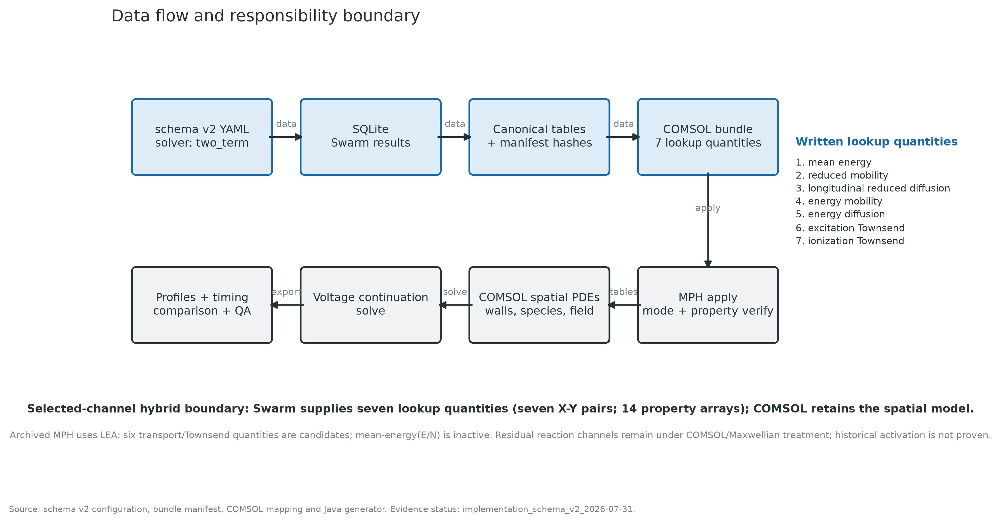
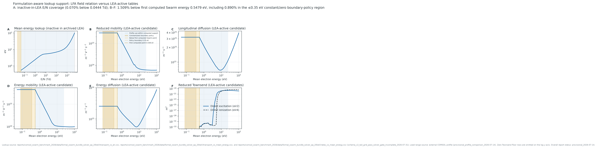
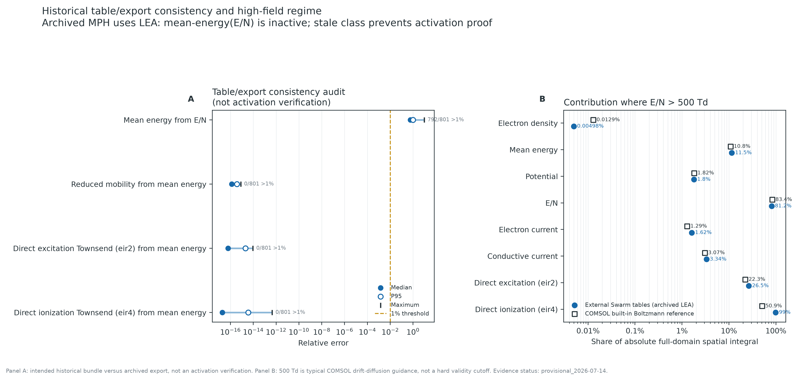
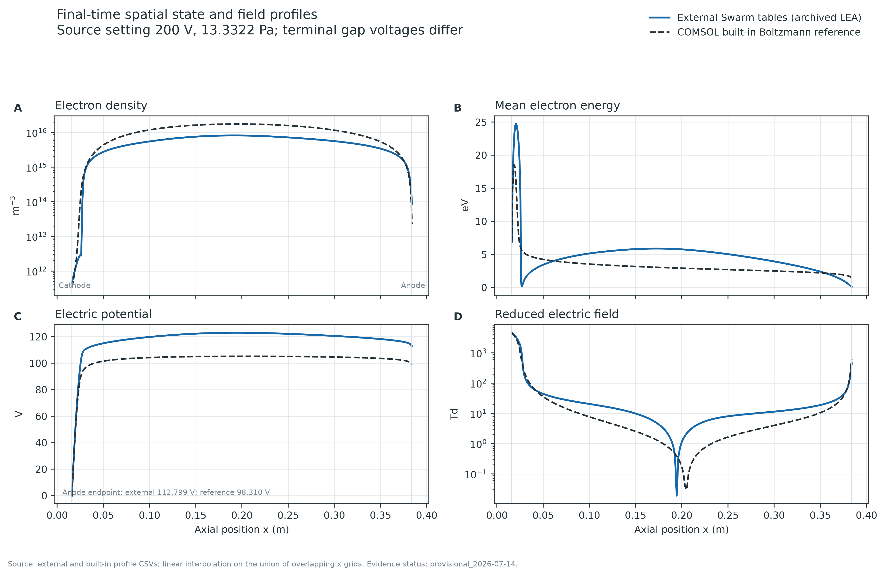
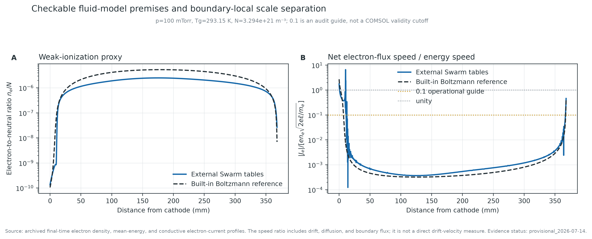
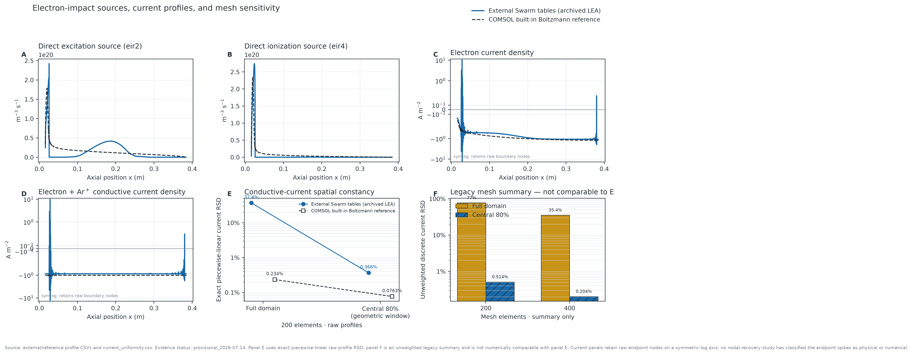
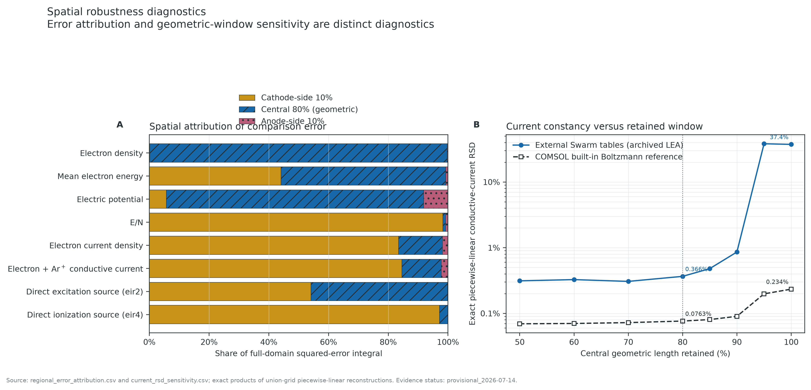
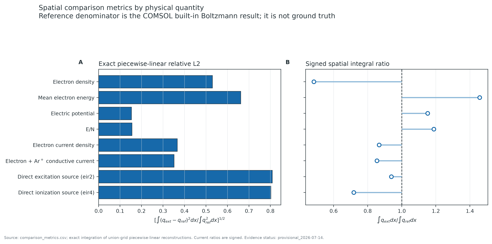
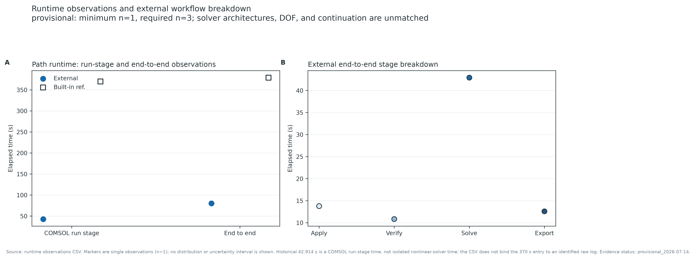

# External Swarm Tables in a COMSOL 1D Argon DC Glow Discharge: A Formulation-Aware Provisional Benchmark

## COMSOL 1次元アルゴンDCグロー放電への外部Swarm表入力：平均エネルギー定式化と反応経路を識別した暫定ベンチマーク

**資料時点:** 2026-07-31  
**文書状態:** 暫定技術ベンチマーク（data quality:
`share_with_caveats`）。2026-07-31のclean再実行はCOMSOL license error -10
（`Product has expired`）によりmodel apply前で停止した。COMSOL空間解と時間は
2026-07-14の履歴出力を再解析しており、正式値ではない。

## English abstract

This report evaluates a provenance-preserving path for applying external
electron-swarm lookup tables to the COMSOL 6.4 one-dimensional argon DC
glow-discharge model. The modeled domain is the complete electrode gap,
including the cathode-fall, Faraday-dark-space, and positive-column regions;
it is not a spatially uniform positive-column calculation. Direct inspection
of the MPH archives establishes that the base model, the archived externally
tabulated model, and the built-in Boltzmann reference all select
`LocalEnergyApproximationE`. They therefore retain the mean-electron-energy
equation; the built-in saved solver additionally solves an EEDF degree of
freedom. The clean implementation contract writes seven lookup quantities as
seven X--Y pairs (14 COMSOL property arrays). In the archived local-energy
formulation, the \(E/N\)-to-mean-energy relation is inactive, whereas four
transport quantities and two direct-reaction Townsend quantities are
candidate active inputs. The archived evidence directly tests only mean
energy, reduced mobility, and the two Townsend quantities; it does not prove
activation of longitudinal or energy transport. Moreover, the external
route replaces selected channels while COMSOL retains the spatial equations,
heavy-particle chemistry, walls, circuit, and residual electron-reaction
treatment. It is therefore a selected-channel hybrid closure, not a complete
external closure.

A clean 31 July 2026 rerun repaired false-positive Java compilation, fresh-class
provenance, stale-output rejection, formulation readback, and table-property
verification, but the COMSOL license expired before model application.
Numerical comparisons consequently use archived single-run, final-time
profiles dated 14 July 2026. The historical Swarm tables were generated at
300 K and 13.3 Pa, whereas the COMSOL profiles used 293.15 K and 13.3322 Pa.
Using exact integration of piecewise-linear reconstructions on the common
nonuniform grid, relative L2 differences were 0.153 for potential, 0.156 for
reduced field, 0.530 for electron density, 0.662 for mean energy, 0.808 for
the `eir2` direct-excitation source, and 0.802 for the `eir4`
direct-ionization source. The line-integrated electron inventory ratio was
0.484 (external/reference). The 200 V source did not impose 200 V across the
plasma: circuit feedback produced gap endpoint voltages of 112.8 and 98.3 V
and ballast currents of 8.72 and 10.17 mA, respectively. Regions above
COMSOL's typical 500 Td drift-diffusion guidance occupied 3.18% and 3.08% of
physical length but accounted for 81.2% and 83.4% of the absolute axial
potential variation and about 99% of the external direct-ionization
integral. This threshold is a regime warning, not a hard validity boundary.

For the 34-point 2026 Swarm sweep, every case passed the EEDF tail-probability
and edge-to-peak grid gates without hitting the 20 keV limit. However, only
23 of 34 cases met the nonlinear solver-convergence gate; all 11 cases from
0.2 through 10 Td reached the 600-iteration cap. These tables are therefore
tail-grid-audited but not yet solver-qualified for a formal COMSOL result.

Archived run-stage wall times were 42.9 s and 370 s, and complete-workflow
times were 80.1 s and 379 s. These single observations are not repeated
performance estimates and their internal timer scopes are not proven
identical. The evidence supports the utility of an auditable, reusable
external-table interface. It does not establish functional activation of
every written quantity, equation-level equivalence, experimental validation,
improved accuracy, or solver superiority.

**Keywords:** electron swarm; COMSOL Multiphysics; local energy approximation;
local field approximation; Boltzmann equation; Townsend coefficient; DC glow
discharge; reproducibility

## 技術要約

本レビューで最も重要な訂正は、対象を「正カラムだけ」とせず、cathode fall、
Faraday dark space、positive columnを含む**電極間全域の1D DCグロー放電**として
扱うこと、ならびに履歴外部経路を「完全な外部局所場closure」と扱わないことで
ある。MPH archiveを直接調べると、基礎MPH、外部表適用MPH、組込みBoltzmann MPHは
いずれも`MeanElectronEnergyModel=LocalEnergyApproximationE`であった。すなわち
履歴外部経路はLocal Field Approximation（LFA）ではなく、平均電子エネルギー
方程式を解くLocal Energy Approximation（LEA）である。

clean実装契約は7 lookup quantitiesを7組のX--Y pair、すなわち14個のCOMSOL
property arraysとして書き込む。LEAでは
\(E/N\rightarrow\bar{\varepsilon}\) relationは非活性で、輸送4量と直接励起・
直接電離Townsendの6量が候補活性集合となる。ただし履歴exportで数値照合できた
のはmean energy、reduced mobility、eir2 Townsend、eir4 Townsendの4 quantity
だけであり、このうちmean-energy relationはLEAで非活性、残る3 quantityは
intended tableと数値整合したにすぎない。縦方向拡散とenergy transportの履歴
activation証拠はない。さらに、外部化したのはselected transport／direct-reaction
channelsだけで、残存反応、EEDF仮定、重粒子chemistry、壁、回路、空間PDEは
COMSOL側に残る。この経路を以後**selected-channel hybrid closure**と呼ぶ。

履歴profileの区分線形厳密積分では、電位と \(E/N\) の相対L2は約0.15である
一方、電子密度、平均電子エネルギー、直接反応源は0.53–0.81であった。電子
密度の正規化形状は近いが、line-integrated electron inventoryは参照の48.4%で
ある。これは粒子在庫の差であり、境界fluxと全反応源がない現状ではglobal
particle balanceの差とは呼ばない。電位と \(E/N\) は微分関係にあるため、
二つの独立な一致証拠とも数えない。

COMSOLがdrift-diffusion近似の典型的目安として挙げる500 Tdを超える領域は
全長の約3%にすぎないが、絶対電位変化の81--83%と外部経路の`eir4`直接電離
積分の約99%を占める。5000 Tdまでtableを用意したことは外挿回避には有用だが、
高電界cathode-side regionにおけるfluid近似または局所性の妥当性を保証しない。
この領域はmodel-form errorと断定せず、解を支配するregime-riskとして扱う。

2026-07-31 Swarm sweepは34/34点でtail probability \(\le10^{-9}\) と
edge-to-peak \(\le10^{-10}\) を満たし、20 keV grid limitへ到達しなかった。
一方、solver convergenceは23/34点だけが合格し、0.2--10 Tdの11点は600反復で
停止した。したがってtail gridは十分でも、正式COMSOL入力としての全case gateは
未達である。

200 V sourceに対するgap endpoint voltageは外部112.799 V、参照98.310 Vで、
ballast currentは8.720 mAと10.169 mAであった。したがってprofile差にはcircuit
operating-point feedbackも含まれる。Townsend sourceを固定profile上でrate formへ
置き換えた反実仮想は、eir2で28.74倍、eir4で1.25倍となり、source representation
感度がprocessごとに大きく異なることを示した。部分energy auditでは
\(\int J_{\rm e}E\,dx\)が28.33／29.54 W m\(^{-2}\)、eir2+eir4 threshold lossは
14.45／16.99 W m\(^{-2}\)であったが、これは完全energy balanceではない。
最大\(n_{\rm e}/N\)は \(2.50\times10^{-6}\)／\(5.34\times10^{-6}\)でweak-ionized
proxyには整合する一方、boundary-locality heuristicは両経路に局所的な警告域を
示す。いずれも実験検証または一方のclosureの優越を意味しない。

電流については、CSVの`total_current_density`を「全電流」と解釈せず、
\(J_{\rm e}+J_{\rm Ar^+}\) の伝導電流と呼ぶ。中央80%のRSDは幾何学的窓の
一様性指標であり、物理的bulk、ambipolarity、charge conservationを証明しない。
`eir2`／`eir4`も全励起／全電離ではなく、基底Arからの直接反応channelである。

2026-07-14の42.914 sと370 sはPDE kernelだけのsolution timeではなく、model
load、run、save等を含み得る履歴run-stage wall timeである。8.62倍と4.73倍は
速度差の候補だが、各経路1観測、異なるtimer scopeの可能性、履歴compiler欠陥を
持つためperformance claimには使わない。



*図1. schema-v2設定からCOMSOL空間解までのデータフロー。7 lookup quantities
（7 X--Y pairs、14 property arrays）のwritten-property監査と、LEA/LFA別の
equation-level activationを分離する。Swarmはselected transport／direct-reaction
tablesを供給し、COMSOLは空間PDE、残存反応、壁、重粒子chemistry、回路、mesh、
nonlinear/time-dependent solverを保持する。*

## 1. 問題設定

### 1.1 COMSOL 1D Ar DCグロー放電モデル

対象はCOMSOL Plasma Module 6.4 Application Libraryの
[DC Glow Discharge, 1D](https://doc.comsol.com/6.4/doc/com.comsol.help.models.plasma.positive_column_1d/positive_column_1d.html)
を基礎とする。計算区間は \(x=0.016\)--\(0.384\ {\rm m}\)、電源電圧は
200 V、圧力は0.1 Torr（13.3322 Pa）、ballastは10 kΩである。powered anodeと
grounded cathodeの間で、cathode側はイオン衝突による二次電子放出係数0.35を
持ち、保存MPHの放出電子平均エネルギーは
\(15.8-2\times5=5.8\ {\rm eV}\)である。200 Vは電極間電圧を固定する値ではなく、
ballastを含む電源電圧であり、plasma gap voltageは放電電流と連成して決まる。
公式meshは両端へ指数的に細分化した200要素、最大／最小要素長比50である。
電流は空間微分から計算されるため、公式手順はlog formulationのquadratic shape
functionを指定する。

電子についてはcontinuity、drift-diffusion momentum closure、平均電子
エネルギー方程式を解き、Poisson方程式、Ar重粒子輸送、外部回路と連成する。
1Dでの最小構造は、符号規約を明示すれば概略

\[
\frac{\partial n_{\rm e}}{\partial t}
+\frac{\partial\Gamma_{\rm e}}{\partial x}=R_{\rm e},
\qquad
\Gamma_{\rm e}=-\mu_{\rm e}n_{\rm e}E
-D_{\rm e}\frac{\partial n_{\rm e}}{\partial x},
\qquad E=-\frac{\partial V}{\partial x},
\]

\[
\frac{\partial (n_{\rm e}\bar{\varepsilon})}{\partial t}
+\frac{\partial\Gamma_\varepsilon}{\partial x}=S_\varepsilon,
\qquad
-\frac{\partial}{\partial x}
\left(\epsilon_0\frac{\partial V}{\partial x}\right)=\rho
\]

で表せる。外部transport tableは\(\Gamma_{\rm e}\)と\(\Gamma_\varepsilon\)のclosure、
eir4 ionization Townsendは\(R_{\rm e}\)へ、eir2/eir4は各energy changeを介して
\(S_\varepsilon\)とheavy-species sourceへ入るため、particle source、excitation
source、mean-energyの差は独立ではない。
反応機構はelastic、11.5 eV直接励起、superelastic、15.8 eV直接電離、
stepwise電離、Penning ionization、metastable quenching、二つの表面反応から
なる。保存MPHのstepwise channel `eir5`はenergy change 4.427 eVである一方、
公開Application Libraryページは4.24 eVと記載している。この差は推測で補正せず、
次のclean runでchemistry digestと各reaction propertyをfreeze/read backする。
したがって、本稿で比較できる`eir2`と`eir4`は反応在庫の一部であり、net
electron/ion sourceではない。

このモデルは「正カラムの一様場モデル」ではない。cathode fall、Faraday dark
space、positive columnを含む電極間全域を解き、time-dependent BDF continuationの
最終時刻（nominally 1 s）を保存する。履歴CSVにはstationarity residualがないため、
本稿では「steady state」ではなく**final-time profile**と呼ぶ。公式モデルが述べる
とおり、この1D表現は半径方向壁損失と壁電荷を扱わず、2Dモデルと密度が異なり
得る。

### 1.2 LEAとLFA

COMSOL公式の
[Drift Diffusion Interface](https://doc.comsol.com/6.4/doc/com.comsol.help.plasma/plasma_ug_drift_diffusion.07.02.html)
では、LEAは平均電子エネルギー方程式をcontinuity・fieldと自己無撞着に解き、
輸送・source係数を平均エネルギーでparameterizeする。LFAは平均エネルギー
方程式を解かず、\(E/N\rightarrow\bar{\varepsilon}\) 関係から局所的に平均
エネルギーを与える。この方程式差のため、同じ7 lookup quantities
（7 X--Y pairs／14 property arrays）を保存しても活性集合は同じにならない。

| formulation | 平均エネルギーの決定 | 候補active表 | inactive表 |
|---|---|---|---|
| LEA（履歴外部経路） | \(\bar{\varepsilon}\) PDE | \(\mu_eN\)、\(D_LN\)、\(\mu_\varepsilon N\)、\(D_\varepsilon N\)、eir2/eir4 Townsend | \(E/N\rightarrow\bar{\varepsilon}\) |
| LFA（将来の別benchmark） | \(E/N\rightarrow\bar{\varepsilon}\) table | mean energy、\(\mu_eN\)、\(D_LN\)、eir2/eir4 Townsend | \(\mu_\varepsilon N\)、\(D_\varepsilon N\) |

保存外部MPHでは`SpecifyElectronDensityAndEnergy=UseLookupTables`であり、
root EEDF settingはMaxwellianである。一方、公式の
[DC Glow Discharge, 1D Coupled with the Boltzmann Equation, Two-Term Approximation](https://doc.comsol.com/6.4/doc/com.comsol.help.models.plasma.positive_column_1d_boltzmann/positive_column_1d_boltzmann.html)
に対応する組込み参照MPHはstationary two-term EEDF、50 energy elements、
automatic maximum energyを用い、保存`sol3`は`En`、`Ne`に加えて`F0`、`lam`、
`Td`を含む。組込み側はEEDFからelectron mobilityを得て、残るtransportを
mobilityから導出する設定であり、外部側の4 transport lookupとはparameterization
自体が同じではない。

ここで「候補active」はformulation上必要という意味で、個別表のfunctional
activationを実runで証明済みという意味ではない。正式判定にはroot mode、
active dependent variables、全property readback、個別表±1%摂動に対する解応答
が必要である。

### 1.3 比較経路と統制されていない差

| 比較項目 | 外部Swarm表経路 | 組込みBoltzmann参照 | 解釈上の制約 |
|---|---|---|---|
| 入力MPH | `positive_column_1d.mph`へtableを適用 | `positive_column_1d_boltzmann.mph`のsaved `sol3` | 同一MPHからのclosure-only A/Bではない |
| mean-energy mode | LEA、`comp1.En`を解く | LEA、`comp1.En`と`plas.F0`を含む | 組込み側はEEDF DOFも連成 |
| electron data | schema-v2 `two_term` flux tableをselected channelsへ適用 | COMSOL built-in stationary two-term Boltzmann、50 energy elements | EEDFとtransport parameterizationが異なる |
| transport treatment | 4 transport lookup quantitiesを候補activeとして書込み | EEDF mobilityを用い、残りをmobilityから導出 | mobility以外も含む同一A/Bではない |
| reaction/EEDF residual | selected eir2/eir4 Townsendを外部化；残存channelはCOMSOL property／Maxwellian treatment | heavy-species mole fractions、superelastic／stepwiseを含めEEDFと連成 | complete external closure対complete built-in closureではない |
| cross sections | pure ground-state Arのelastic/eir2/eir4 Swarm set | 同3 cross sectionsはarchive内でbyte/numeric一致 | process inventoryとpopulation couplingは一致しない |
| mesh | 両端指数分布200要素、ratio 50；400は旧summaryのみ | 両端指数分布200要素、ratio 50 | 400 raw欠落、GCI不可 |
| 要素次数 | `FEMLogQuadratic` | `FEMLogLinear` | closure以外の数値離散化差を含む |
| thermal diffusion | off | off | 両経路共通だが一般化範囲を制限 |
| 気体条件 | 履歴table 300 K、13.3 Pa；COMSOL 293.15 K、13.3322 Pa | COMSOL 293.15 K、13.3322 Pa | profile差にtable条件差を含む |
| solver state | table適用後time-dependent continuationのfinal-time profileという履歴 | saved final solver `sol3` | 初期値・保存state・study構成差、stationarity未検証 |

したがって結果は「外部表を含む一つの計算経路」と「組込みBoltzmannを含む参照
経路」の記述的比較である。これはselected-channel hybrid同士の比較であり、
観測差を外部Swarmだけへ因果帰属しない。

## 2. Swarm計算とCOMSOL table契約

### 2.1 schema v2、solver、輸送規約

正式再実行候補は`schema_version: 2`とcanonical solver id `two_term`を用いる。

```yaml
schema_version: 2
run:
  solvers:
    - id: two_term
  # Full executed 34-point grid; not an abbreviated example.
  e_over_n_Td:
    [0.0444, 0.05, 0.075, 0.1, 0.15, 0.2, 0.3, 0.5, 0.75,
     1, 1.5, 2, 3, 5, 7.5, 10, 15, 20, 30, 50, 75, 100,
     150, 200, 300, 500, 750, 1000, 1500, 2000, 3000, 4000,
     4572.507809122825, 5000]
conditions:
  gas_temperature_K: 293.15
  pressure_Pa: 13.3322
  gas_mixture:
    - {species: Ar, fraction: 1.0, mass_amu: 39.948}
feature_policy:
  unsupported: fail
  degraded: record
```

上記は実行manifestと一致する全34点列であり、省略例ではない。公開schemaでは
`run.mode`、旧solver alias、
`both`／`all`、黙示的feature無視を用いない。本`two_term`の輸送係数はflux
definitionであり、bulk transport coefficientと交換可能ではない。今回の
longitudinal/transverse diffusionは同じisotropic \(f_0\) momentから作られる
ため、独立なanisotropic diffusion計算と解釈しない。

homogeneous swarm表では

\[
v_d=(\mu_eN)(E/N),\qquad
\frac{\alpha_j}{N}=\frac{k_j}{|v_d|}
\]

を満たすようrateからreduced Townsendを作る。COMSOL公式1Dモデルは、field-driven
DC discharge、とくにcathode-fallの記述と数値安定性のためTownsend formを採る。
この変換はCOMSOLがdirect reactionに電子fluxとTownsend係数を使う形式と整合する
が、空間PDE内のsource同値性を単独で証明しない。低mean-energy派生floorの
\(E/N=0\) 行では、COMSOLへ注入しない
diagnostic `drift_velocity_m_s`を0とし、計算点の物理値と区別した。

### 2.2 table domain、LEA lookup domain、Swarm convergence gate

2026-07-31入力候補は \(0.0444\le E/N\le5000\ {\rm Td}\)、計算された平均電子
エネルギー0.5479--100.143 eVの34点である。COMSOLで暗黙外挿させないため、
0、0.05、0.1、0.2、0.35 eVへ明示的な派生行を追加し、transportを最低計算点で
保持、非弾性rate/Townsendを0とした。この5点はSwarm計算値ではなくmanifest化
したboundary policyである。

LEAで候補activeなtransport／Townsend tableの引数は \(E/N\) ではなく
\(\bar{\varepsilon}\) である。履歴外部profileでは、平均エネルギーが最初の
計算点0.5479 eVを下回る区間が5.554 mm、全長の1.509%あり、constant
boundary-policy region（\(\bar{\varepsilon}\le0.35\ {\rm eV}\)）は3.275 mm、
0.890%であった。派生lookup自体は0 eVから始まるため、実際のlookup argumentが
domain外となる空間割合は0%である。ただし0.35 eV以下でeir2/eir4を0とする選択は
物理計算値ではなく人工的なboundary policyであり、正式runではfloor位置と
低energy continuationを変えたmatched sensitivityが必要である。

履歴外部profileの \(E/N\) は0.0190--4631 Tdで、最新の計算 \(E/N\) 下限
0.0444 Td未満は全長の0.0698%、上限超過は0%であった。しかしLEAでは
\(E/N\rightarrow\bar{\varepsilon}\) relationがinactiveなので、この0.0698%は
active lookup coverageの主診断ではなく補助指標である。

EEDF numerical gridについては、34/34点でtail probability \(\le10^{-9}\)、
edge-to-peak \(\le10^{-10}\)、20 keV limit未到達を確認した。最大の実使用gridは
5000 Td caseの13.693 keVである。一方、非線形solverは23/34点だけが収束し、
0.2、0.3、0.5、0.75、1、1.5、2、3、5、7.5、10 Tdの11点は残差
\(1.52\times10^{-7}\)--\(6.87\times10^{-7}\)で600反復上限へ到達した。
したがって**tail-grid gate 34/34**と**solver-convergence gate 23/34**を分け、
このtableを正式COMSOL数値の入力としてqualifiedとは呼ばない。



*図2. 2026-07-31 schema-v2 Swarm tableと、2026-07-14履歴COMSOL profileの
使用域。panel Aの \(E/N\rightarrow\bar{\varepsilon}\) relationは履歴LEAでは
inactiveである。active候補tableのmean-energy軸では、0.5479 eV未満が1.509%、
0.35 eV以下のconstant/zero boundary-policy regionが0.890%を占める。gold bandは
計算Swarm domain外を補うpolicyで、物理的に検証された低energy解ではない。証拠
vintageが異なるため、同一runのactivation証明でもない。*

### 2.3 COMSOLへ書き込む7 lookup quantities（14 property arrays）

各quantityは独立変数Xと従属変数Yのpairであり、COMSOL API上では2 arraysを
占める。したがって契約全体は「7 arrays」ではなく、**7 X--Y pairs = 14 property
arrays**である。

| No. | lookup quantity | COMSOL X/Y property pair | X unit → Y unit | 履歴LEAでの位置づけ |
|---:|---|---|---|---|
| 1 | \(E/N\rightarrow\bar{\varepsilon}\) | `pes1.enrgXdata/enrgYdata` | V m² → eV | stored / inactive |
| 2 | \(\mu_eN(\bar{\varepsilon})\) | `pes1.muNXdata/muNYdata` | eV → \(1/({\rm V\,m\,s})\) | candidate active |
| 3 | \(D_LN(\bar{\varepsilon})\) | `pes1.deNXdata/deNYdata` | eV → \(1/({\rm m\,s})\) | candidate active |
| 4 | \(\mu_\varepsilon N(\bar{\varepsilon})\) | `pes1.mueNXdata/mueNYdata` | eV → \(1/({\rm V\,m\,s})\) | candidate active |
| 5 | \(D_\varepsilon N(\bar{\varepsilon})\) | `pes1.denNXdata/denNYdata` | eV → \(1/({\rm m\,s})\) | candidate active |
| 6 | eir2 direct-excitation \(\alpha/N\) | `eir2.xtownratedata/ytownratedata` | eV → m² | candidate active |
| 7 | eir4 direct-ionization \(\alpha/N\) | `eir4.xtownratedata/ytownratedata` | eV → m² | candidate active |

全7 quantity／14 property arraysのsource CSV対property readbackは、clean runの
written-property監査として有用である。ただし履歴archiveが残すactivation
diagnosticは、mean energy、\(\mu_eN\)、eir2 Townsend、eir4 Townsendの4 quantity
だけで、\(D_LN\)、\(\mu_\varepsilon N\)、\(D_\varepsilon N\)の空間exportまたは
摂動応答を含まない。よって「7項目を履歴runで全空間照合済み」とは記載しない。
mean-energy relationもLEAの活性表として扱わない。

### 2.4 履歴activation diagnostic

履歴run summaryが指すintended bundleとexported profileを比較すると、照合可能な
4 quantityのうち\(\mu_eN\)とeir2/eir4 Townsendは全801点で1%以内に一致した。
一方、
\(E/N\rightarrow\bar{\varepsilon}\) tableに対するexported mean energyは
median 57.9%、95 percentile 97.6%、maximum 959%の相対差を持ち、792/801点が
1%を超えた。この不一致はMPH rootがLEAで、mean-energy tableがinactiveという
readbackと整合する。

したがって履歴証拠が示すのは、3 active候補quantityの**数値整合**と、LEAで
inactiveなmean-energy relationの期待どおりの不一致だけである。縦方向拡散、
energy mobility、energy diffusivityのfunctional activationは未検証である。

さらに履歴compileはreturn code 0にもかかわらず標準出力に
`Failed to compile java file`と`Compilation failed`を含んだ。実行classが
同時生成Javaに対応する証拠がないため、この比較は正式activation verification
ではなく、履歴出力とintended tableのdiagnosticである。



*図8. 左：履歴export対intended tableのrelative-error分布。mean-energy tableの
大きな不一致はLEAでの非活性と整合する。右：\(E/N>500\ {\rm Td}\)の空間長と
主要量の絶対積分寄与。500 TdはCOMSOLのtypical guidanceで、硬い判定閾値では
ない。*

## 3. 再現性修復と実行経路

### 3.1 compiler、class、MPH provenance

修復後runnerは次を実装する。

1. runごとの空class directoryへJavaをstageする。
2. compiler return codeに加えてfailure textを検査する。
3. class欠落、空file、Javaより古いclass、前run classを拒否する。
4. apply後MPHが入力MPHと同一hashなら失敗する。
5. Java/class、input/output MPH、mapping、bundle、config、cross sectionの
   SHA-256を保存する。
6. COMSOL version/build、電圧列、pressure、temperature、mesh element count、
   root `MeanElectronEnergyModel`をread backする。
7. apply、verify、run、exportを別COMSOL batchとして記録する。

履歴2026-07-14出力にはこのprovenanceが揃わず、stale classを排除できない。
2026-07-31 clean attemptはfresh class生成後、最初のCOMSOL applyでlicense
error -10により停止した。古いMPHを新結果として採用せず、失敗logとhashを
`data/clean_run_attempts/`へ保存した。

### 3.2 実用コマンド

外部SwarmからCOMSOLまでの再現経路は次である。

```powershell
$PY = ".\.tmp\venv\Scripts\python.exe"
$COMSOL = "C:\Program Files\COMSOL\COMSOL64\Multiphysics_copy1\bin\win64\comsolbatch.exe"

& $PY -m swarm_workflow.cli sweep `
  reports\comsol_swarm_benchmark_2026\repro\workflow_argon_comsol_benchmark_2026.yaml

& $PY -m swarm_workflow.cli build-tables `
  outputs\comsol_swarm_benchmark_2026\swarm_qualified_20keV.sqlite `
  --output outputs\comsol_swarm_benchmark_2026\tables_solver_qa_20keV `
  --source two_term

& $PY -m swarm_workflow.cli export-comsol `
  outputs\comsol_swarm_benchmark_2026\tables_solver_qa_20keV\mixture_0000 `
  --output outputs\comsol_swarm_benchmark_2026\bundle_solver_qa_20keV

& $PY reports\comsol_swarm_benchmark_2026\repro\prepare_low_energy_bundle.py `
  outputs\comsol_swarm_benchmark_2026\bundle_solver_qa_20keV `
  outputs\comsol_swarm_benchmark_2026\bundle_solver_qa_20keV_low_energy

& $PY reports\comsol_swarm_benchmark_2026\repro\run_external_benchmark.py `
  --mapping Model\maps\positive_column_external.yaml `
  --bundle outputs\comsol_swarm_benchmark_2026\bundle_solver_qa_20keV_low_energy `
  --comsol $COMSOL `
  --output-root outputs\comsol_swarm_benchmark_2026\external_200_clean `
  --repetitions 3 --mesh-elements 200 `
  --pressure-Pa 13.3322 --gas-temperature-K 293.15
```

組込み参照と400要素感度を含む全コマンドは`repro/README.md`に記載する。
output rootは存在しないpathを指定し、archiveを上書きしない。
`solver_qa`は品質監査対象を表すlabelであり、合格を意味しない。solver
convergenceが23/34の現状ではCOMSOL正式適用gateを満たさず、runnerは全case gateを
確認して適用を拒否すべきである。

## 4. 比較方法

### 4.1 区分線形profileの厳密空間積分

外部 \(q_{\rm ext}(x)\) と参照 \(q_{\rm ref}(x)\) を重複区間
0.016–0.384 mに制限し、両格子のunionへ線形補間する。各区間幅を \(h\)、
端点値を \(y_0,y_1\) とすると、線形再構成に対し

\[
\int_{x_0}^{x_1}y^2\,dx =
\frac{h}{3}\left(y_0^2+y_0y_1+y_1^2\right)
\]

は厳密である。積、平均、varianceも同じ区分線形関数から厳密積分する。主指標は

\[
E_{L2,\mathrm{PL}} =
\left[
\frac{\int(q_{\rm ext}-q_{\rm ref})^2dx}
{\int q_{\rm ref}^2dx}
\right]^{1/2},
\qquad
R_I=\frac{\int q_{\rm ext}dx}{\int q_{\rm ref}dx}.
\]

既存の「節点値二乗を台形積分」した値は、狭いedge spikeを過大評価し得るため
sensitivity列へ降格する。point-count-equal-weight離散L2は非一様meshの空間
測度にならず、追跡用supplementだけに残す。相関はamplitude一致を示さない。

電位の \(R_I\) は共通ground境界下のdescriptive quantityであり、gauge-invariant
な保存量ではない。signed currentの積分比は符号規約を保持し、absolute integral
shareと区別する。

### 4.2 幾何学窓、電流、領域別誤差

\(J_{\rm cond}=J_{\rm e}+J_{\rm Ar^+}\) の空間population RSDを全域と、両端
10%を物理長で除いた中央80%窓で求める。cut pointを補間挿入し、非一様節点数に
依存させない。中央窓を「bulk」、外側を「sheath」と呼ばない。物理的領域同定には
少なくともion density、charge imbalance、Debye length、field-gradient scale、
boundary fluxが必要であり、履歴CSVには不足する。

誤差の位置を示すため、squared-error integralをcathode-side 10%、central 80%、
anode-side 10%へ分解する。この分割も幾何学定義である。conductive-current RSDは
一様性の記述であり、

\[
\frac{\partial\rho}{\partial t}
+\frac{\partial J_{\rm cond}}{\partial x}=0
\]

の弱形式残差またはterminal/circuit current一致を代用しない。

### 4.3 高電界regime

COMSOL公式
[drift-diffusion theory](https://doc.comsol.com/6.4/doc/com.comsol.help.plasma/plasma_ug_drift_diffusion.07.17.html)
は、この近似が通常pressure約10 mtorr以上、weakly ionized・collisionalで、
\(E/N\) がtypically 500 Td未満のとき適する、と説明する。本条件0.1 Torrは
pressure目安を満たすが、最大 \(E/N\approx4.6\ {\rm kTd}\) はfield目安を大きく
超える。そこで500 Tdとの線形交点で区間を分け、空間長と各量のabsolute integral
shareを報告する。これはhard cutoffではなくmodel-regime flagである。

### 4.4 timing

履歴`solve_only`列はCOMSOL class起動、MPH load、continuation、saveを含む
run-stage wall timeであり、内部PDE kernelの`Solution time`とは区別する。
end-to-endは外部経路でapply+verify+run+export、参照経路で保存solverのbatch
全体である。正式値は同じtimer contract、別process、各3反復の中央値とrangeを
用いる。現在は各path \(n=1\)である。

## 5. 暫定結果

### 5.1 stateとfield

| 量 | exact PL relative L2 | PL correlation | signed integral ratio 外部／参照 |
|---|---:|---:|---:|
| 電子密度 | 0.530 | 0.995 | 0.484 |
| 平均電子エネルギー | 0.662 | 0.778 | 1.457 |
| 電位 | 0.153 | 0.994 | 1.152 |
| \(E/N\) | 0.156 | 0.993 | 1.188 |
| 電子電流密度 | 0.366 | 0.592 | 0.867 |
| 電子＋Ar⁺伝導電流密度 | 0.351 | weak/非解釈 | 0.854 |
| eir2直接励起source | 0.808 | 0.646 | 0.939 |
| eir4直接電離source | 0.802 | 0.785 | 0.718 |

電子密度のcorrelation 0.995とintegral ratio 0.484の組合せは、「正規化shapeは
近いがamplitudeとline-integrated electron inventoryが異なる」ことを示す。
境界particle fluxとprocess-resolved net sourceがないため、後者をglobal particle
balanceとは呼ばない。密度peakは外部が参照の約46.8%、位置はcathode側へ約
3.56 mmずれた。mean-energy peakは1.33倍で約1.79 mm anode側へずれた。これらの
差をdirect-ionization tableだけへ帰属できず、輸送、stepwise／Penning、
二次電子、回路、solver stateを含む。

電位と \(E/N\) のshapeは近いが、\(E/N\) は電位勾配から導かれるため独立な二つの
validationではない。外部profileはLEAであり、mean energyも \(E/N\) lookupの
従属量ではなく、PDEと外部energy-transport tableの結果である。



*図3. 2026-07-14履歴profile。青実線は外部Swarm表経路、黒破線は組込み
Boltzmann参照。組込み値はground truthではない。*

### 5.2 回路feedbackを含むoperating point

電源の200 Vとplasma gap endpoint voltageを区別すると、二経路の差は次のように
整理される。

| quantity | 外部Swarm表経路 | 組込みBoltzmann参照 |
|---|---:|---:|
| source voltage | 200.000 V | 200.000 V |
| anode／gap endpoint potential | 112.799 V | 98.310 V |
| ballast drop | 87.201 V | 101.690 V |
| ballast current \(V_R/10\,{\rm k\Omega}\) | 8.720 mA | 10.169 mA |
| internal maximum potential | 123.021 V at 0.19455 m | 105.223 V at 0.20545 m |
| maximum minus anode endpoint | 10.222 V | 6.912 V |
| \(\int |\partial V/\partial x|\,dx\), axial absolute potential variation | 133.243 V | 112.136 V |
| \(E/N>500\ {\rm Td}\) regionの\(\int|\partial V/\partial x|\,dx\) share | 81.21% | 83.40% |

したがって外部表の変更は、局所係数だけでなく放電電流、ballast drop、gap voltageを
介して全体のoperating pointへfeedbackする。電位のinternal maximumはfield
reversalのproxyだが、履歴CSVはsigned electric fieldをexportしていないため、
反転位置・符号を直接検証したものではない。またこのballast currentは回路式からの
推定であり、未exportのterminal current、displacement current、電極面積を置換
しない。

### 5.3 Townsend源表現、direct source、高電界寄与

COMSOLのTownsend formでは、process \(j\) のvolume sourceは

\[
S_{T,j}=\frac{\alpha_j}{N}\,N\frac{|J_{\rm e}|}{e},
\]

である。本Swarm bundleは
\(\alpha_j/N=k_j/|v_{d,\mathrm{swarm}}|\) と定義する。一方、通常のrate formは
\(S_{k,j}=Nn_{\rm e}k_j\) である。両者が局所的に一致するには、少なくとも
\(|\Gamma_{\rm e}|=n_{\rm e}|v_{d,\mathrm{swarm}}|\) が必要である。空間PDEの
\(\Gamma_{\rm e}\) はdriftだけでなくdiffusionとboundary-layer behaviorを含む
ため、この同値性は自動ではない。

履歴sourceをTownsend formから再構成すると、eir2、eir4とも相対
\(4\times10^{-14}\)以内で一致し、export列の意味を確認できた。同じ履歴profileを
固定してrate formをpostprocessしたcounterfactualは次のとおりである。

| channel | observed Townsend integral | rate-form counterfactual | rate／observed |
|---|---:|---:|---:|
| eir2 direct excitation | \(5.1924\times10^{18}\ {\rm m^{-2}s^{-1}}\) | \(1.4924\times10^{20}\ {\rm m^{-2}s^{-1}}\) | 28.742 |
| eir4 direct ionization | \(1.9309\times10^{18}\ {\rm m^{-2}s^{-1}}\) | \(2.4140\times10^{18}\ {\rm m^{-2}s^{-1}}\) | 1.250 |

これはsource representationへの感度を示す**固定profileの反実仮想**であり、
rate formのほうが正しい、または優れるという証拠ではない。正式比較には、同一
MPHでTownsend/rate formを切り替えて自己無撞着に再収束させる必要がある。

`eir2` direct excitationと`eir4` direct ionizationのintegral ratioは0.939と
0.718だが、relative L2は約0.81と0.80で、局所分布差が大きい。特にdirect
ionizationの重心は外部 \(x\approx0.0233\ {\rm m}\)、参照
\(x\approx0.0686\ {\rm m}\)であり、幾何学中央80%が占める積分割合は外部約1.0%、
参照約35.8%であった。外部direct ionizationはcathode-side high-field regionへ
著しく集中する。

\(E/N>500\ {\rm Td}\)の空間長は外部11.694 mm（3.18%）、参照11.316 mm
（3.08%）であった。この短い領域が`eir2`積分に占める割合は外部26.5%、
参照22.4%、`eir4`積分では外部99.0%、参照51.0%であった。したがってsource差の
主要部分は、COMSOL自身がtypical
drift-diffusion rangeを超えると注意する領域にある。table上限の拡張は外挿を
防ぐが、この領域のlocal-equilibrium／fluid妥当性を改善しない。これは確定した
model-form errorではなく、結論を支配し得るregime-riskである。

### 5.4 部分電子energy audit

履歴exportだけで構成できるenergy auditは、signed field work
\(\int J_{\rm e}E\,dx\)と、eir2/eir4 sourceへ各thresholdを掛けたlossに限られる。

| path | \(\int J_{\rm e}E\,dx\) | eir2 threshold loss | eir4 threshold loss | eir2+eir4 | direct loss／field work |
|---|---:|---:|---:|---:|---:|
| 外部Swarm表 | 28.325 W m\(^{-2}\) | 9.567 W m\(^{-2}\) | 4.888 W m\(^{-2}\) | 14.455 W m\(^{-2}\) | 0.510 |
| 組込み参照 | 29.541 W m\(^{-2}\) | 10.189 W m\(^{-2}\) | 6.805 W m\(^{-2}\) | 16.994 W m\(^{-2}\) | 0.575 |

これはenergy balanceの完結判定ではない。elastic exchange、superelastic、
stepwise/Penning、他のvolume loss、energy-flux divergence、wall loss、
secondary-electron input、transient storageが欠落する。したがって0.510と0.575の
差をenergy conservation errorとも、external closureの優劣とも解釈しない。

### 5.5 weak-ionization proxyとboundary heuristic

293.15 K、13.3322 Paから得るneutral number densityは
\(N=3.2940\times10^{21}\ {\rm m^{-3}}\)である。最大
\(n_{\rm e}/N\)は外部 \(2.50\times10^{-6}\)、参照
\(5.34\times10^{-6}\)で、weakly ionizedという必要条件には整合する。ただし
collisionality、locality、Knudsen numberを単独で保証しない。

boundary／fluid scale separationの補助指標として

\[
\chi(x)=
\frac{|J_{\rm e}|}
{e n_{\rm e}\sqrt{2e\bar{\varepsilon}/m_{\rm e}}}
\]

を計算した。最大値は外部7.62、参照2.71で、著者が操作的に置いた
\(\chi>0.1\)の空間割合は3.53%と2.12%、\(\chi>1\)は0.341%と0.609%であった。
\(\chi\)はnet flux、density、mean energyから作るheuristicで、drift-only ratio、
mean-free-path、Knudsen number、またはCOMSOL公式のhard criterionではない。
boundary-localized非平衡を探索する場所を示す補助量としてのみ用いる。



*図9. weak-ionization proxy \(n_{\rm e}/N\)とnet-flux speed ratio \(\chi\)。
0.1は本解析のoperational guideであり、普遍的な妥当性閾値ではない。500 Td
regime flag、tail convergence、energy relaxation/locality診断と組み合わせて
解釈する。*

### 5.6 conductive currentとmesh感度

200要素external raw profileの区分線形厳密積分では、
\(J_{\rm cond}\) RSDは全域37.37%、幾何学中央80%で0.366%である。組込み参照は
それぞれ0.234%と0.0763%であった。edge-local
variationが全域RSDを増幅するが、これを数値artifactと断定しない。旧summaryの
point-count-weighted RSDは200要素76.96%／0.5137%、400要素
35.37%／0.2036%（全域／中央80%）である。400要素raw profileがなくexact
spatial metricへ再計算できず、2 meshだけなのでformal grid-convergence study
ではない。

さらにexternal archiveは`FEMLogQuadratic`、built-in archiveは
`FEMLogLinear`であり、element countが同じでも離散化次数とDOFは同じでない。
したがって200/400の旧summaryもclosure sensitivityとmesh sensitivityを分離
できない。

retained windowを50–85%へ変えてもexternal RSDは約0.4–0.6%に留まる一方、
95%ではedge regionを含んで急増する。この感度は局所変動の位置を示すが、
positive columnの物理境界を定義しない。



*図4. `eir2`直接励起、`eir4`直接電離、電子電流、電子＋Ar⁺伝導電流とRSD。
exact raw-profile指標と旧200/400 point-count summaryを別panelに示す。*

### 5.7 誤差の空間局在

relative squared-errorのcathode-side 10%／central 80%／anode-side 10%寄与は、
電子密度で0.139%／99.59%／0.271%、\(E/N\)で98.29%／0.932%／0.780%、
電子伝導電流で83.47%／14.65%／1.88%、direct ionizationで
97.19%／2.81%／0.002%であった。密度差は中央窓のamplitude差、field・direct
ionization・current差は主にcathode-side high-field regionへ局在する。



*図7. 左：quantity別relative squared-errorの幾何学領域寄与。右：retained
central-window幅に対するconductive-current RSD。幾何学窓を物理的sheath/bulk
区分と解釈しない。*

### 5.8 metric summary



*図5. exact piecewise-linear relative L2とsigned spatial-integral ratio。
参照分母はCOMSOL組込みBoltzmannであり、実験ground truthではない。*

### 5.9 履歴timing

| scope | 外部表経路 | 組込み参照 | 参照／外部 |
|---|---:|---:|---:|
| run-stage wall time | 42.914 s | 370 s | 8.62 |
| end-to-end wall time | 80.120 s | 379 s | 4.73 |

外部end-to-endの履歴内訳はapply 13.780 s、verify 10.838 s、run-stage
42.914 s、export 12.588 sである。組込み側との内部timer scopeが同一という証拠は
なく、各path \(n=1\)、履歴class provenanceも不完全である。built-in saved solver
がEEDF DOF `F0`を含むことは、table経路の高速化仮説に物理的・数値的な根拠を
与えるが、8.62倍をsolver speedupとして採用する根拠にはならない。

別のraw logでは、組込み経路にinternal solution約298 s、class約306 s、
total約307 s、11,659 DOFという記録があり、外部側には約6 sのsolve blockが4回、
class/total約38 s、2,006 DOFという記録がある。しかしこれらを370 s／42.914 sの
CSV行へ一意にbindするrun IDとhashがなく、代替値として採用しない。むしろ
timer scope、continuation sequence、EEDF energy dimension、DOFが大きく異なる
ことを示すprovenance warningである。正式性能比較は同一hardware、独立batch
process、同一stage boundary、各3反復、完全raw logで行う。



*図6. 履歴batch/run-stageとcomplete workflowのwall time。各categoryは
single observationで、whiskerまたは分布を表さない。370 s行を特定raw logへ
結び付けられず、DOFとtimer scopeも異なるため、speedup estimateではない。*

## 6. 外部Swarm入力の有用性

現時点で立証できる主な有用性は、精度優越ではなく次の三点である。

1. **監査可能性:** solver、physics feature、cross section、混合比、温度・圧力、
   flux/bulk規約、単位、range、floor、input hashをbundle manifestに固定できる。
2. **交換可能性:** COMSOLのgeometry、wall、circuit、heavy chemistryを保ちながら
   selected electron transport／direct-reaction tableを差し替えられる。
3. **再利用可能性:** 局所closureが妥当な複数空間条件で同じSwarm tableを使い、
   spatial runごとのEEDF solveを省ける可能性がある。

一方、table lookupが速いことは物理的妥当性を保証しない。高field gradient、
energy relaxation length、time history、anisotropy、e-e collision、magnetic
field、state-resolved populationが重要なら、local closureは不足し得る。未対応
featureは`feature_policy`に従ってfail、skip、または明示approximationとし、
黙って無視しない。

この有用性はhybrid性を明示して初めて再現可能になる。すなわち、外部表へ置換
したprocess、COMSOL側に残したprocess、その各processが参照するEEDF／mean-energy
closure、metastableなどtarget populationの出所をcoverage matrixとして保存する
必要がある。「外部Swarm入力済み」だけでは、electron kinetics全体を外部化した
という意味にならない。

## 7. BOLSIG+、MCIG等の第三者Swarm入力要件

現製品はBOLSIG+／MCIG等をbenchmark referenceとして読めるが、一般の
third-party outputをCOMSOL bundleへ直結するadapterは持たない。将来adapterは
external source identityをcanonical solver id
`two_term`／`multi_term`／`monte_carlo`から分離し、少なくとも次を要求する。

| contract | 必須metadata |
|---|---|
| source | software、version/build、input file hash、adapter version |
| solver class | two-term、PN/multi-term、MC；angular closure／DCS moments |
| transport convention | flux/bulk、longitudinal/transverse、sign convention |
| independent variables | \(E/N\)、mean energy、energy grid、unit |
| thermodynamic state | mixture fraction、\(T_g\)、pressureまたはnumber density |
| coefficients | mobility、diffusion、energy transport、rate／Townsendとunit |
| process identity | reactant/product、threshold、degeneracy、cross-section id、COMSOL feature tag |
| process coverage | external／COMSOL-residual／disabled、target-state population source、stepwise／superelastic treatment |
| EEDF | normalization、energy variable、isotropic/higher moments |
| validity | min/max、interpolation、extrapolation/floor、missing values |
| uncertainty | replica、SE/CI、convergence flag |
| feature treatment | requested/applied/approximated/unsupported |
| provenance | raw input hash、canonical output hash、conversion formula |

adapterはparse → schema/unit validation → canonical records → quality gate →
table build → COMSOL exportの順に処理する。欠落係数、未知unit、flux/bulk不明を
zero/defaultで補わず、明示的に失敗させる。ordinary integral cross sectionだけの
multi-termをexact DCS solverとlabelしない。Dujkoらのmulti-term論文と
steady-state Townsend Monte Carlo論文は、non-conservative transportにおける
solver／flux-bulk／angular-model規約の必要性を示すために引用しており、本COMSOL
cathode fallの検証資料または外部表の精度証明として引用するものではない。
公開schemaとadapter実装自体は本稿の範囲外である。

## 8. 制約と正式採用gate

### 8.1 現在の制約

1. clean COMSOL runはlicense errorでapply前に停止した。
2. 履歴classは生成Javaとの対応が証明されていない。
3. 履歴Swarm tableとCOMSOL profileの温度・圧力が一致しない。
4. 二経路は同一MPH・反応在庫・要素次数・initial stateのclosure-only A/Bでなく、
   selected-channel hybrid closureの範囲も異なる。
5. clean contractの7 lookup quantities（14 property arrays）に対し、履歴診断は
   mean energy、mobility、eir2/eir4だけである。拡散・energy transportを含む
   functional activationを完走していない。
6. \(E/N>500\) Td regionがdirect ionizationを強く支配する。
7. formal Swarm sweepはtail-grid gate 34/34だがsolver-convergence gate 23/34で、
   0.2--10 Tdの11点が600反復上限へ達した。
8. 400要素raw profileがなく、GCI、order of convergence、mesh-independent
   edge currentを評価できない。
9. ion density、charge density、Debye length、displacement／terminal current、
   boundary fluxがなく、physical regionとglobal balanceを定義できない。
10. 履歴profileはtime-dependent solveのfinal-time出力で、stationarity residual、
    process-resolved particle balance、完全なelectron-energy balanceがない。
11. 保存MPHのstepwise `eir5` energy change 4.427 eVと公開ページの4.24 eVが
    一致せず、reaction-property digestをfreezeしていない。
12. timingは各path \(n=1\)、同一内部timer scopeが未証明で、370 s行を特定raw
    logへbindできない。
13. 1D Ar、DC、無磁場、e-e無効、履歴profile一組に限られ、実験validationと
    cross-section／wall／metastable uncertaintyを評価していない。

### 8.2 正式結果へ更新する条件

- valid license下でclean compile → apply → root mode readback → property verify →
  run → exportを完走する。
- 34/34 Swarm caseでtail-grid gateとsolver-convergence gateの両方を満たし、
  failed pointを含むbundleのCOMSOL適用を禁止する。
- LEAとLFAを別benchmarkとし、mode-aware active/inactive集合を照合する。
- 各lookup quantityを±1%摂動し、\(\Delta n_e,\Delta V,\Delta J,\Delta S\)のnormで
  functional activationを確認する。
- 外部・組込みを同一timer contract、独立process、各3反復で測る。
- 200/400要素の両経路raw profileを保存し、可能なら800要素を加える。
- 同じ293.15 K、13.3322 Pa、reaction inventory、mesh、solver stateへ統制する。
- chemistry digestとして全reaction tag、reactant/product、threshold／energy
  change、rate source、metastable fraction treatmentをread backする。とくに
  `eir5` 4.427 eV／公開4.24 eVの差を固定・説明する。
- \(E/N>500\) Td share、energy-relaxation/locality、global particle/charge
  balance、terminal current、boundary fluxを出力する。
- final-timeだけでなく、\(\partial n/\partial t\)、\(\partial w_{\rm e}/\partial t\)、
  circuit current変化によるstationarity gateを保存する。
- process-resolved particle sourceとelectron-energy source/lossをexportし、
  Townsend formとrate formを同一MPHで再収束させる。
- exact PL L2、integral ratio、correlation、conductive-current RSDを再計算する。
- Java/class/MPH/bundle/config/cross-section hashとfull raw logを保存する。

closureの因果差を分離する正式比較は、次のA/B/C ladderで行う。

| rung | electron mobility | diffusion／energy transport | 目的 |
|---|---|---|---|
| A | built-in EEDF mobility | COMSOLがmobilityから導出 | 組込みbaseline |
| B | external Swarm mobility | Aと同じCOMSOL導出規則 | mobility sourceだけを置換 |
| C | external Swarm mobility | external \(D_LN,\mu_\varepsilon N,D_\varepsilon N\) | 全4 transport table追加の増分 |

各rungで同じMPH、mesh/order、reaction inventory、initial state、continuation、
Townsend/rate representationを用い、その後にselected eir2/eir4 tableの有無を
別factorとして加える。これにより「external versus built-in」という一括比較を、
mobility、残りのtransport、direct reaction representationの因果比較へ分解する。

満たせない場合、2026-07-14値は今後も暫定技術benchmarkとしてのみ引用する。

## 9. 結論

外部Swarm表を、cathode fallからpositive columnまでを含むCOMSOL 1D Ar DC
glow-discharge modelへ渡す経路は、clean class、hash provenance、formulation
readback、property-level監査、profile比較まで再現可能な形に整理できた。専門
レビューにより、履歴経路はLFAではなくLEAであり、clean contractは7 lookup
quantitiesを7 X--Y pairs／14 property arraysとして書き込む一方、履歴archiveが
数値診断するのはmean energy、mobility、eir2/eir4だけであることが明確になった。
この訂正により、外部入力の実態は「平均エネルギーPDEとCOMSOL residual
chemistryを残し、selected transportとselected Townsend dataを外部化する
hybrid経路」と定義できる。

履歴final-time数値は、field/potential shapeよりもdensity amplitude、mean energy、
direct reaction source、cathode-side conductive currentで大きな差を示す。
200 V sourceに対しgap endpoint voltageは112.8／98.3 V、ballast currentは
8.72／10.17 mAであり、closure差とcircuit operating pointのfeedbackを分離
できない。とくに外部direct ionizationは、全長約3%の
\(E/N>500\) Td領域へほぼ集中する。
したがって広いtable rangeとactivationは必要条件だが、物理妥当性の十分条件では
ない。

現段階で外部Swarm入力の価値として主張できるのは、**electron-data contractを
明示的、交換可能、provenance-preservingにすること**である。built-in Boltzmann
の完全代替、実験精度の改善、一般的な8.62倍高速化は立証されていない。license
更新後のformulation-aware clean rerunに加えて、現Swarm sweepの
solver-convergence gate（23/34）を34/34へ引き上げ、A/B/C transport ladder、
functional activation、high-field/locality diagnostic、stationarityとglobal
balanceを完走することが次の決定点である。本稿は暫定method/benchmark reportで
あり、solver superiority、accuracy superiority、experimental validationを
主張しない。

## 参考文献

1. COMSOL AB, [DC Glow Discharge, 1D](https://doc.comsol.com/6.4/doc/com.comsol.help.models.plasma.positive_column_1d/positive_column_1d.html), COMSOL Multiphysics 6.4 Application Library.
2. COMSOL AB, [DC Glow Discharge, 1D Coupled with the Boltzmann Equation, Two-Term Approximation](https://doc.comsol.com/6.4/doc/com.comsol.help.models.plasma.positive_column_1d_boltzmann/positive_column_1d_boltzmann.html), COMSOL Multiphysics 6.4 Application Library.
3. COMSOL AB, [The Drift Diffusion Interface](https://doc.comsol.com/6.4/doc/com.comsol.help.plasma/plasma_ug_drift_diffusion.07.02.html), version 6.4.
4. COMSOL AB, [Drift–Diffusion Model](https://doc.comsol.com/6.4/doc/com.comsol.help.plasma/plasma_ug_drift_diffusion.07.04.html), version 6.4.
5. COMSOL AB, [Introduction to Drift–Diffusion Theory](https://doc.comsol.com/6.4/doc/com.comsol.help.plasma/plasma_ug_drift_diffusion.07.17.html), version 6.4.
6. COMSOL AB, [Plasma Module User’s Guide](https://doc.comsol.com/6.4/doc/com.comsol.help.plasma/PlasmaModuleUsersGuide.pdf), version 6.4.
7. G. J. M. Hagelaar and L. C. Pitchford, “Solving the Boltzmann equation to obtain electron transport coefficients and rate coefficients for fluid models,” *Plasma Sources Science and Technology* **14** (2005) 722–733, [doi:10.1088/0963-0252/14/4/011](https://doi.org/10.1088/0963-0252/14/4/011).
8. S. Dujko and R. D. White, “A multi term Boltzmann equation analysis of non-conservative electron transport in time-dependent electric and magnetic fields,” *Journal of Physics: Conference Series* **133** (2008) 012005, [doi:10.1088/1742-6596/133/1/012005](https://doi.org/10.1088/1742-6596/133/1/012005).
9. S. Dujko, R. D. White, and Z. Lj. Petrović, “Monte Carlo studies of non-conservative electron transport in the steady-state Townsend experiment,” *Journal of Physics D: Applied Physics* **41** (2008) 245205, [doi:10.1088/0022-3727/41/24/245205](https://doi.org/10.1088/0022-3727/41/24/245205).
10. S. Pancheshnyi et al., “The LXCat project: Electron scattering cross sections and swarm parameters for low temperature plasma modeling,” *Chemical Physics* **398** (2012) 148–153, [doi:10.1016/j.chemphys.2011.04.020](https://doi.org/10.1016/j.chemphys.2011.04.020).

## データと再現性

履歴raw profile/logは`data/archive_2026-07-14/`、clean failure evidenceは
`data/clean_run_attempts/`、schema-v2 table候補は
`data/formal_swarm_bundle_solver_qa_20keV/`、そのworkflow databaseは
`data/formal_swarm_database_solver_qa_20keV.sqlite`、派生CSV・QA・hashは
`data/derived/`に保存した。`solver_qa`は監査対象を表し、合格を意味しない。
solver convergence 23/34のため本稿の正式採用gate上はprovisional candidateである。
解析notebookは
`benchmark_analysis_executed.ipynb`、PNG/PDF図は`figures/`、sourceの採否と
vintageは`SOURCE_INVENTORY.md`、実行コマンドは`repro/README.md`を正とする。
